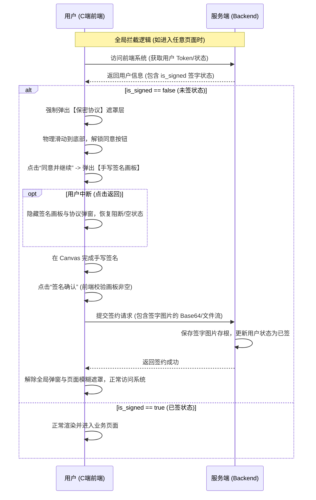

---
tags:
  - 产品原型
  - 护卫军
  - 保密协议
  - 合规审计
date: 2026-07-10
---

# 护卫军 - 用户签约与保密协议原型演示

这是关于东风护卫军 C 端用户首次登录系统时，强制签署《保密承诺书》以及新用户签约的交互演示原型。

## 在线预览地址
👉 **[在线 Demo 预览（GitHub Pages）](https://rondotang.github.io/guard-corps-confidentiality-demo/)**
*(注：如果点击后显示 404，可能是 GitHub Pages 仍在构建中，请耐心等待 1-2 分钟后再刷新)*

## 场景逻辑说明
为了满足审计要求的“强阻断”原则，且针对微信 H5 无退出登录概念的现状，该原型演示了以下两个场景：

### 1. 场景一：全局弹窗拦截（对应老用户和静默登录的新用户）
用户进入系统首页后，会被弹窗强制拦截。
* **物理隔离**：点击“暂不同意”会弹出二次挽留，若坚持拒绝，则页面会变成“无访问权限”的空状态拦截页。
* 只有在这种空状态下，才能确保用户在未签保密协议前，无法看到或操作系统内的任何敏感汽车业务数据。

### 2. 场景二：签约表单嵌入（对应需手动输入身份信息的新用户）
* 在底部新增协议勾选项，并且**无法直接打勾**。
* 必须点开协议正文，拉到底部点击“同意”后，才能成功勾选并激活签约按钮。

### 备注
原型中的《用户协议》与《保密承诺书》正文内容，在实际开发中需通过接口从后台的**【文章管理】**模块动态拉取展示，以便业务运营随时更新条款。

## 手写签名流程时序图 (供开发参考)

