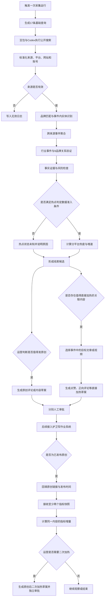

# AI热点发现与护卫军作业联动产品需求文档

| 项目 | 内容 |
|---|---|
| 文档版本 | v0.2 |
| 文档日期 | 2026-09-04 |
| 文档状态 | 待产品、运营、研发评审 |
| 目标用户 | 护卫军运营、内容运营、产品管理员、研发运维、护卫军用户 |
| 业务目标 | 识别具体平台正在快速发酵的东风相关事件，先判断哪些事件值得发起原创增长作业，再根据原创发布后的传播增长决定是否追加加热；若热点事件已有可执行的关联文章或视频，同时评估是否直接对该内容加热 |
| 本阶段目标 | 在尚未具备稳定热点数据源的前提下，验证公开信息线索发现、证据核验、事件研判和原创增长草案；对已实际发布的原创登记结果、接收指标快照、观察增长并按需生成原创后二次加热草案；另行验证热点关联源内容直接加热支路；本阶段达标不等于具备真实热点监测能力 |
| 保密要求 | API Key、Token、Cookie及个人敏感信息不得写入文档、配置、日志或模型输入 |

---

# 1. 执行摘要

## 1.1 问题定义

业务要求系统围绕一条原创增长主链回答两个连续问题，并增加一个热点关联内容的补充判断：

1. **哪些热点值得发原创作业？**识别哪个平台、哪个东风相关事件正在快速发酵，判断是否值得借势形成原创内容增长。
2. **原创发布后是否需要追加加热？**原创内容实际发布后，回收链接和同口径传播指标，判断是否出现增长，以及是否继续组织点赞、正向评论等加热作业。
3. **热点关联文章或视频是否值得直接加热？**当事件中已有可执行的平台内容时，作为补充支路判断是否直接对其组织点赞、正向评论等加热作业。

因此，业务结构是**一条原创增长主链＋一条热点关联源内容直接加热支路**。主链从“值不值得发原创”延伸到“发布后是否追加加热”；支路只在事件中存在合适的关联文章或视频时启用。原创后二次加热与源内容直接加热的目标对象、触发条件和审批记录必须分开。

## 1.2 问题拆解与业务闭环

围绕原创增长主链和关联内容加热支路，将业务规划拆为以下连续环节：

| 问题拆解 | 需要回答的问题 | 对应产品设计 |
|---|---|---|
| 发现 | 哪些平台出现了新的东风相关内容和讨论 | 持续采集或检索、来源标准化、平台与账号识别 |
| 判断 | 多条内容是否属于同一事件，事件是否正在发酵 | 无效过滤、转载去重、事件聚合、热点数据准入与分平台趋势计算 |
| 决策 | 事件是否与东风相关、是否值得通过原创响应；是否存在可直接加热的关联内容 | 品牌关系、实体存疑原因、事实证据、风险提示、原创价值和源内容可执行性复核 |
| 主链执行：原创增长 | 哪些事件值得形成原创内容，在哪个平台表达 | 原创评论／原创内容草案、建议平台、平台能力标签匹配和运营审批 |
| 主链反馈：原创后效与追加加热 | 原创发布后是否产生传播增长，是否需要进一步加热该原创内容 | 回填原创链接、接收两个以上同口径指标快照、计算增量、运营判断、生成原创后二次加热草案并独立审批 |
| 补充支路：关联源内容直接加热 | 热点事件中是否已有值得放大的平台文章或视频 | 目标来源选择、目标链接、点赞／正向评论等动作、时间窗、目标人群和运营审批 |
| 规则反馈 | 三类草案及实际执行是否达到业务目标 | 回收执行结果，优化行动选择、时间窗、人数、频控与平台规则 |

完整业务闭环如下：

```text
平台内容持续发现
→ 来源清洗与事件聚合
→ 热点判定或公开信息线索识别
→ 东风关联与风险研判
→ 运营判断是否值得发原创
→ 生成原创评论／内容草案→运营审批→实际发布→回填原创链接
→ 后效指标快照→增长观察→运营判断是否生成原创后二次加热草案→独立审批

补充支路：若事件已有可执行的关联文章／视频
→ 运营判断是否值得直接放大
→ 生成绑定该目标的点赞／正向评论等加热草案→运营审批
→ 后续对接护卫军作业系统完成分发与结果回流
```

## 1.3 分阶段方案

产品分为两个连续阶段：

| 阶段 | 数据基础 | 解决的问题 | 输出 |
|---|---|---|---|
| 公开信息线索与作业联动PoC | 豆包、Codex公开搜索、可访问网页，以及已发布原创链接的人工／业务系统指标回传 | 公开线索能否被清洗、聚合和研判；能否形成原创增长草案；原创发布后能否记录快照、观察增量并生成独立二次加热草案；若事件已有可执行关联内容，能否形成直接加热草案 | 事件线索、原创增长草案、原创发布记录、后效快照、增长判断、原创后二次加热草案，以及可选的关联源内容直接加热草案 |
| 真实热点能力 | 稳定的平台原生数据或专业舆情数据源 | 哪个平台、哪个事件正在快速发酵，是否达到响应时机 | 分平台热点状态、增速、风险等级、响应建议 |

两阶段共用来源标准化、事件聚合、品牌关联、风险判断、作业草案和运营审核能力。PoC通过标准接口或人工凭证接收已发布原创链接和指标快照；正式分发、平台自动采集与任务执行仍由后续业务系统联动建设。

## 1.4 关键判断

1. **公开搜索可以帮助发现公开信息线索，但不能独立证明真实热点。**真实热点仍需平台原生内容、互动量、短时增速、独立作者/UGC规模、账号影响力和覆盖审计。
2. **AI可以承担证据整理、事件聚合辅助、风险提示和作业草案生成，但不能替代运营作出高风险事实判断和正式发布决策。**
3. **原创后追加加热是主链的第二个业务判断。**必须先有已审批原创草案、实际发布链接和至少两个同口径指标快照；系统只计算增量，不用跨平台统一阈值自动决定是否加热，运营结论和二次加热草案均需留痕并单独审批。
4. **关联源内容直接加热是补充支路，且必须绑定具体目标。**草案必须引用当前事件证据中的一篇文章或一个视频，记录平台、内容链接和互动动作；官网、普通网页、平台不明或无有效链接的来源不能生成加热草案。
5. **自动化联动是后续目标，但本阶段不预设必须建设MCP。**系统联动可采用标准数据/事件推送，由护卫军业务系统按既定规则消费并生成作业；也可采用受控MCP工具调用。两种方式都必须复用同一数据契约、审批、权限和审计规则。

## 1.5 阶段一与业务期望对照

阶段一只验证现有搜索、AI分析和护卫军业务能力能够支撑的部分，不把未具备的数据能力包装成已实现。

| 业务规划步骤 | 业务期望 | 阶段一能做到 | 与业务期望的差距及结论 |
|---|---|---|---|
| 持续监测目标平台 | 持续发现微博、抖音等平台出现的新内容和新增讨论 | 按9个品牌、8个行业主题触发豆包与Codex公开搜索，召回被公开收录的信息 | 搜索不是平台持续采集，覆盖范围和收录延迟不可控；**不能承诺发现目标平台的全部热点** |
| 判断哪里正在发酵 | 根据平台原生互动量、短时增速、独立作者/UGC规模判断具体平台和事件的热度变化 | 核验公开页面、发布时间、来源证据和事件更新，形成相关事件线索 | 缺少未知链接前的平台原生指标、连续快照和覆盖审计；**不能输出真实热点评级、增速或预警** |
| 判断是否与东风相关、是否值得响应 | 识别品牌、车型、人物和事件关系，判断风险与行动价值 | 完成来源清洗、事件聚合、东风关联、风险提示和人工复核分流 | **可以验证**；但高风险事实、存疑实体和最终行动决策必须由运营审核 |
| 判断哪些热点值得发原创作业 | 热点达到响应条件后形成原创任务，借势做内容增长 | 基于已核验证据生成原创评论或原创内容作业草案，并附事实依据、风险说明、建议平台和禁止表述 | **可以验证草案质量，不能证明候选就是真实热点**；是否创建正式作业仍由运营审批 |
| 按成员擅长平台分发 | 根据平台能力标签选择目标人群并下发 | 复用现有平台能力标签形成建议人群和分发快照 | **可以验证匹配逻辑**；真实下发依赖标签与作业接口联调，并保留人工审批 |
| 原创发布后继续观察与加热 | 回收原创内容链接和传播指标，判断是否出现增长、是否继续组织点赞和正向评论 | 对已审批原创登记实际发布链接；接收项目现有采集服务、业务推送或人工凭证的指标快照；计算首个与最新快照增量；由运营决定继续观察、无需加热、人工核验或生成原创后二次加热草案 | **可以验证后效闭环，但不自动执行互动**；至少需要两个同口径快照，公众号／视频号无自动数据时由人工凭证兜底，跨平台不比较绝对值 |
| 对热点关联源内容直接加热 | 当事件中存在可执行的具体文章或视频时，判断是否需要直接组织点赞、正向评论等互动 | 运营从事件证据中选择一个可执行平台链接，系统生成绑定目标内容、平台、动作和风控说明的加热草案 | **可以验证补充支路的草案与审批链路**；不能自动判定该内容真实热或值得加热，目标有效性和业务价值由运营确认，草案不得自动发布 |

阶段一对外称为“公开信息线索与作业联动PoC”。达标表示线索研判、原创增长主链、原创发布后效与二次加热草案，以及可选的关联源内容直接加热支路可行；不表示已经具备全平台持续发现或真实热点判定能力。

## 1.6 本阶段SMART目标

| 维度 | 要求 |
|---|---|
| 具体 | 对9个业务品牌及8个行业主题执行公开搜索，完成来源核验、事件聚合、品牌关联和风险提示；生成原创增长草案，对已发布原创登记链接、接收至少两个同口径指标快照并形成后效判断和可选二次加热草案；事件有可执行关联内容时，可另行生成源内容直接加热草案 |
| 可衡量 | 每次运行生成17条基础查询、34个双路搜索任务；记录查询覆盖率、来源完整率、聚合准确率、候选通过率、草案修改率、原创链接回填率、快照完整率、增量可计算率和人工处理时长 |
| 可实现 | 使用现有豆包搜索、Codex公开搜索、规则处理、人工审核及已知链接效果采集能力完成；公众号和视频号效果以人工凭证兜底 |
| 相关 | 验证信息发现、事件研判、原创增长、原创发布后效追踪与追加加热主闭环，以及热点关联源内容直接加热支路，并量化真实热点数据源与平台效果采集缺口 |
| 有时限 | 10个工作日完成：配置冻结1天、按测试计划手工触发双路运行并连续观察7天、数据汇总2天；自动每3小时采集暂不启用，不承诺生产级7×24运行保障 |

## 1.7 成功标准

1. 基础查询覆盖率为100%，未执行、失败、无结果必须分别记录。
2. 有效来源必填字段完整率为100%；缺失发布时间、账号或正文时必须显式说明。
3. 公开搜索产生的事件100%不得输出真实热点评级，并必须说明不可判定原因。
4. 明确无效来源不进入运营候选主列表；误杀率目标在PoC样本完成后标定为`[TBD]`。
5. 每个任务草案均包含品牌关系、事实证据、风险说明、建议平台和禁止表述。
6. 事件聚合准确率、候选通过率、人工已知线索漏检率和人工审核时长形成可复算基线，目标值在首轮样本后标定。
7. 每个源内容加热草案必须绑定一个属于当前事件的有效来源ID和URL，并明确平台、互动动作及不可自动判定的原因；不满足条件时不得生成草案。
8. 原创发布记录必须绑定已审批原创增长草案；没有两个同口径指标快照时不得输出增长判断或生成原创后二次加热草案。
9. 原创后二次加热草案必须绑定原创发布记录、实际原创链接和触发评估ID，并与热点源内容加热草案分别审批。

---

# 2. 用户体验与功能

## 2.1 用户角色

### 运营审核人

- 查看信息线索、事件证据、品牌关系、风险和AI建议。
- 对事件只提交“通过”或“驳回”两种最终审核结果；通过时再选择事实结论和行动方向。
- 按主链审批原创增长草案，并在实际发布后审批原创后二次加热草案；若事件存在可执行关联内容，另行审批源内容直接加热草案。
- 查看原创发布后的指标增量，决定继续观察、无需加热、人工核验或生成二次加热草案。

### 内容运营

- 补充官方事实、素材和允许使用的表达。
- 优先确认事件是否值得形成原创增长草案；若事件存在可执行的关联文章或视频，再补充判断是否直接加热并指定目标。
- 确认目标平台和禁用表述。
- 对已发布原创回填链接和发布时间，必要时补充微信系人工凭证。

### 产品管理员

- 维护品牌范围、品牌别名、查询目录、来源规则和业务规则版本。
- 发布、停用和回溯配置版本。

### 研发运维

- 维护采集适配器、规则处理、数据存储和业务接口。
- 处理失败重试、运行监控、数据审计和告警。

### 护卫军用户

- 后续接收与自身擅长平台匹配的原创增长作业或源内容加热作业。
- 本轮PoC不进入正式任务触达与执行。
- 后续完成原创任务后回填本人实际发布链接，供后效追踪与运营判断。

## 2.2 核心用户流程



## 2.3 功能需求

### F01 配置管理

系统必须管理以下配置：

1. 业务品牌和品牌别名。
2. 来源平台、网站、域名和官方账号。
3. 品牌查询、行业主题查询和关联补采查询。
4. 自动无效过滤、URL规范化、去重和事件聚合规则。
5. 事件级实体判断、品牌关系、风险和候选分类规则。
6. 热点判定数据准入条件和分平台热度模型。
7. 原创增长草案、源内容加热目标、平台推荐、互动动作和审批规则。
8. 原创链接回填、指标字段映射、快照窗口、后效判断和原创后二次加热规则。
9. 输出字段、枚举和数据保留规则。

所有配置必须具备版本号、生效时间、修改人、修改原因、草稿/已发布/已停用状态。新运行使用最新已发布版本，历史运行保留原版本，禁止修改已被运行引用的配置版本。

### F02 查询任务生成

每次完整运行必须生成：

- 9条品牌基础查询。
- 8条行业主题查询。
- 每条基础查询分别由豆包和Codex执行，共34个基础搜索任务。

运行前生成查询覆盖清单。运行后记录每个任务的成功、失败、无结果和未执行状态。未执行不得解释为无结果。

行业主题结果不能直接归属品牌。每个有效行业事件必须分别验证与9个启用品牌的关系，不轮换、不抽样。

### F03 公开搜索接入

豆包与Codex都执行同一份17条基础查询目录。豆包用于公开网页召回，Codex使用本机登录态执行公开搜索、补充召回并核验可访问页面。每次完整运行形成17条查询×2个工具＝34个独立任务；快速验证形成1条查询×2个工具＝2个独立任务。两个工具分别记录请求状态、搜索时间、查询词、结果顺序和原始响应引用。

搜索排序、搜索结果数和供应商权威等级只作为原始搜索字段保留，不得进入热度计算。

单一搜索工具失败时继续执行另一工具并将批次标记为部分成功；两个工具均失败时标记为失败。服务端对完整运行设置3小时冷却、快速验证设置10分钟冷却；重复点击直接返回剩余等待时间。自动每3小时采集当前保持暂停，启动本地服务不会自动产生豆包调用。

### F04 来源标准化

每条来源统一输出：

- 采集来源、查询ID和运行ID。
- 来源平台、网站名称、发布账号及账号链接。
- 原始URL、规范化URL、标题、摘要、正文。
- 发布时间、事件时间、首次发现时间和采集时间。
- 发布者类型、是否官方、是否转载及重复来源ID。

同一规范化URL只保留一条`source_item`，但每一次由哪个工具、哪个查询、何时搜索发现，必须分别写入`source_discovery`。工作台同时展示内容发布时间和搜索获取时间，支持按两类时间分别筛选；发布时间超过72小时且无新增事实或新回应时直接进入无效日志。

无法识别平台或账号时保持未知状态并说明原因，禁止AI补造。只有已确认域名或账号可标记为官方来源。

### F05 自动无效过滤

以下数据经确定性规则确认后直接进入无效日志，不进入人工候选：

- 无有效URL且无法获得可核验证据。
- 同名误匹配且与汽车或目标品牌无关。
- 纯招标、采购、招聘、组织任免或内部行政信息。
- 纯经销商报价、优惠和到店引流。
- 超过72小时且没有新增事实、新回应或传播变化的旧闻。
- 品牌导航页、百科页、常驻产品页等没有新增事件的页面。
- 完成9品牌关系验证后仍与目标品牌无关的行业事件。

无效日志必须记录命中规则、原因、处理时间和原始来源，支持运营抽检和恢复误过滤数据。

### F06 去重与事件聚合

1. 同一规范化URL只生成一个来源记录；每个搜索工具、查询ID、查询词和搜索获取时间作为独立发现记录保留，不覆盖或拼接成不可追溯字段。
2. 正文指纹相同的内容保留一条主记录，其他记录标记为重复。
3. 同一原始发布主体的跨站转载只计一个独立事实来源。
4. 事件按主体、动作、对象和事件日期聚合。
5. 同一列表页包含多个业务动作时必须拆为多个事件。
6. 事件更新仍挂在原事件下，并标记新增事实或新增回应。

来源数和独立来源数只表示证据广度，不表示平台热度或用户讨论规模。

### F07 品牌与事件内实体判断

品牌及品牌别名是需要长期维护的主数据。只有`active`品牌及其精确别名可以形成确定性品牌匹配；弱别名必须同时满足汽车上下文。

车型、人物、活动和机构不要求维护完整清单，由AI在具体事件中识别：

| 判断结果 | 系统处理 |
|---|---|
| 名称、身份和品牌关系有可访问证据支持，且证据无冲突 | 写入当前事件的`entity_mentions`并保留证据 |
| 疑似新车型、新活动、身份冲突、同名歧义、正文无法核验或仅有单一弱来源 | 写入`entity_uncertainties`，记录不确定原因、建议关系和证据来源，事件进入人工复核 |
| 人工确认或修改 | 只更新当前事件结论，不自动写回全局实体主数据 |

实体存疑不能自动证明事件与品牌有关，也不能单独导致事件无效。

### F08 品牌关系验证

品牌关系状态包括：

| 状态 | 定义 | 后续处理 |
|---|---|---|
| `direct_mention` | 原始内容直接命中启用品牌 | 继续证据与风险判断 |
| `verified_relation` | 关联补采找到可访问的品牌关系证据 | 继续证据与风险判断 |
| `unresolved` | 存在疑似关系，但事实、实体或时间证据不足 | 人工复核 |
| `no_relation` | 完整验证后仍无品牌关系证据 | 自动进入无效日志 |

AI只能提出关系建议；最终状态由品牌字典、来源证据和确定性规则共同生成。

### F09 热点判定数据准入规则

“热点判定数据准入规则”是系统输出真实热点结论前必须通过的数据条件检查。它不是对事件价值的判断，也不代表数据未通过就必须丢弃。

只有同时满足以下条件，系统才允许计算`normal/rising/breaking/sustained/declining`等热点状态：

1. 能识别来源平台和平台内容ID。
2. 能获得该平台原生播放、阅读、点赞、评论、分享或收藏等指标。
3. 同一内容或事件存在连续指标快照，可计算明确时间窗口内的增量和速度。
4. 能区分独立作者或新增UGC，避免把同源通稿转载当成用户讨论。
5. 数据源提供覆盖范围、采集时间、延迟、失败和漏采说明，可审计追溯。

任一条件不满足时：

```json
{
  "hotspot_judgement_available": false,
  "hotspot_status": "unknown",
  "hotspot_unavailable_reason": [
    "缺少平台原生互动指标",
    "缺少连续指标快照",
    "无法说明平台覆盖范围"
  ]
}
```

未通过准入的数据仍可形成“相关事件线索”或“品牌内容机会”，并生成需要运营审核的任务草案；但不得表述为“正在爆发”“平台热点”，也不得以热点为依据自动下发作业。

### F10 风险判断、补证与人工复核

以下情况必须进入人工复核：

- 事故、安全、召回、销量、价格、监管、竞品比较或高阶智能驾驶表述。
- 负面风险词与弱信源、绝对化断言或事实冲突同时出现。
- 只有单一二手来源但可能具有响应价值。
- 品牌关系、车型、人物身份、事件时间或事实存在不确定项。
- AI无法提供完整证据、输出明确不确定项或结构校验失败。

风险词只用于召回和提高复核优先级，不能单独构成负面、抹黑或事实结论。AI不得解除高风险状态。

补证不是事件审核结论。运营点击“发起补证”时，系统先生成可检查的补证方案，展示要解决的不确定问题、搜索词、回看时间、拟使用的Codex／豆包工具和预计调用次数；此时不产生搜索调用。运营确认后才执行定向搜索。单个工具失败保留另一工具结果，补证完成后事件回到“待审核”，系统不得自动通过或生成草案。没有明确不确定问题或没有可行补证来源时，应直接驳回，不发起补证。

### F11 候选分类

| 分类 | 进入条件 | 可否生成任务草案 |
|---|---|---|
| 待审核 | 通过清洗并聚合成事件；包含事实证据、风险和不确定项 | 不可以 |
| 相关事件线索 | 运营审核通过，确认事件事实成立且可考虑响应 | 可以，由运营选择行动方向 |
| 品牌内容机会 | 运营审核通过，确认属于可主动传播的品牌内容机会 | 可以，由运营选择行动方向 |
| 已驳回 | 运营判断不值得生成作业，或证据不足且无明确补证路径 | 不可以 |

分类是运营处理优先级，不是热点等级。

### F12 原创增长主链与关联内容加热支路

事件通过运营审核后，先判断是否值得通过原创内容借势增长；当事件中存在可执行的平台文章或视频时，可另行启用直接加热支路：

- **原创增长主链**：生成原创评论或原创内容草案，用于借势形成内容增长；实际发布后必须进入F16—F18的后效追踪和追加加热判断。
- **关联源内容直接加热支路**：直接对热点事件中的一篇文章或一个视频生成互动草案，不要求用户另发原创内容；当没有合适目标时不启用该支路。

两类草案共用事件ID、行动方向、任务类型、任务标题、事实背景、建议平台、目标用户标签、证据来源、风险说明和禁止表述。关联源内容直接加热草案还必须包含目标来源ID、目标URL、目标内容标题和互动动作。

同一事件可生成一份原创增长草案；如有可执行的关联内容，可对最多三条不同目标来源分别生成直接加热草案。各草案分别审批。草案只能引用已经核验的事实。PoC阶段仅保存`draft_pending_review`，不自动创建正式作业、不自动发布、不自动触达用户。

### F13 运营审核

运营可以：

- 查看事件、来源、平台、账号、时间、品牌关系和不确定项。
- 查看AI摘要、事实证据、风险和已确认执行的补证结果。
- 最终审核只选择“通过”或“驳回”；驳回必须填写原因。
- 通过时选择“相关事件线索”或“品牌内容机会”作为事实结论，再勾选“原创增长”和／或“热点源内容加热”行动方向。
- 事实结论本身不自动生成作业；只有“审核通过＋至少一个行动方向”才能生成对应草案。选择源内容加热时必须指定当前事件中的具体可执行文章或视频。
- 草案生成后再修改任务类型、完整作业要求、平台、目标标签、截止时间和表达边界。

所有操作必须记录审核人、时间、结论、行动方向、目标来源和修改前后内容。继续观察仅保留在原创发布后效环节，不作为事件审核结果。

### F14 按擅长平台匹配建议

进入系统联动阶段后，任务草案根据用户现有平台能力标签匹配目标人群。平台推荐综合事件来源平台、内容形态、任务目标和用户标签，不能把来源平台直接等同于建议发布平台。

系统生成目标人群快照并保留频控、配额和排除原因。自动发布保持关闭，待业务确认审批责任和接口后开放。

### F15 热点源内容加热草案

源内容加热草案必须从当前事件证据中选择具体目标文章或视频，并同时满足：

- 目标来源属于当前事件证据，且保留可追溯的`target_source_id`。
- 目标URL有效，能够直接定位到平台内容，不是官网列表页、普通网页或平台不明链接。
- 系统能够识别目标平台及其支持的互动动作。
- 运营明确确认该内容值得放大，并选择点赞、正向评论、转发或收藏等实际动作。
- 草案写明任务人数、时间窗与频控为`[TBD/待运营确认]`，不得默认大规模集中执行。

草案通过审批后也不自动下发。关联源内容直接加热是可选补充支路，不等待原创发布；业务问题二“原创发布后是否追加加热”由F16—F18独立触发。

原创增长草案的`task_brief`至少包含：作业详情、必带话题、核心命题、已核验证据与编号、按推荐平台分别生成的内容形态和发帖技巧、创作方向参考、违规／申诉／风险边界。无法从证据确认话题标签时必须标注“待运营补充”，不得由AI臆造。平台建议基于事件内容形态和证据判断，可由运营编辑后再审批。

### F16 原创发布结果登记

只有`draft_purpose=original_growth`且状态为`approved`的草案，才能登记原创发布结果。登记内容包括：

- 原创发布记录ID、关联事件ID和原创草案ID。
- 发布平台、实际内容URL、平台内容ID（如可获得）、内容标题。
- 发布时间、回填人和回填时间。

同一原创URL不得重复登记。登记只表示原创内容已经在下游业务中实际发布，不代表系统自动发布成功。

### F17 原创后效指标快照与增量观察

系统接收项目现有采集服务、业务系统推送或人工凭证三类数据来源。每个快照记录采集时间、数据来源、平台可得指标、不可采原因和备注。

- 支持播放／阅读、点赞、评论、转发、收藏等平台可得基础指标。
- 至少两个包含指标且口径一致的快照，才能计算首个与最新快照之间的增量。
- 任一指标回退或口径变化时标记`data_anomaly`，不得自动生成二次加热草案。
- 系统只能输出`growth_observed`、`no_growth_observed`或`data_anomaly`等同一内容增量观察，不把它解释为全平台热点，也不跨平台比较绝对值。
- 公众号、视频号无法自动采集时，允许上传人工凭证并写明不可采原因。

### F18 原创后二次加热判断与草案

运营基于指标增量、内容价值、传播窗口、平台规则和频控，选择：

- `create_followup_boost`：生成原创后二次加热草案。
- `watch`：继续等待新的指标快照。
- `no_boost`：结束本次后效追踪，不进一步加热。
- `manual_review`：指标异常、来源或口径存疑，转人工核验。

原创后二次加热草案必须绑定原创发布记录ID、触发评估ID、实际原创URL、目标平台和互动动作；与热点源内容加热草案使用不同`draft_purpose`，并独立编辑和审批。审批通过仍不自动执行点赞、评论或转发。

### F19 列表分页与查询

运行批次、信息线索、事件、作业草案、原创发布记录、自动无效和操作审计均使用服务端分页。接口统一接收`page`、`page_size`并返回`items`、`page`、`page_size`、`total`；默认每页20条、单页上限100条。筛选条件变化时回到第1页，上一页／下一页不可越界。信息线索额外支持按搜索获取起止时间和内容发布起止日期筛选。

## 2.4 用户故事与验收标准

### US01 触发完整运行

作为运营，我希望一次运行覆盖全部品牌和行业主题，以便区分“没有结果”与“没有执行”。

验收标准：

- 运行前显示17条基础查询和34个搜索任务。
- 每个任务显示成功、失败、无结果或未执行。
- 任一缺失查询均产生明确告警。
- 完整运行3小时内、快速验证10分钟内重复触发时，服务端拒绝并显示剩余冷却时间。
- 自动采集为暂停状态；服务启动不会自动执行搜索。

### US02 查看统一事件

作为运营，我希望按事件而不是按搜索链接审核，以便快速理解事实和证据。

验收标准：

- 一个事件展示全部来源、平台、账号、时间和转载关系。
- 展示独立来源数但不将其解释为热度。
- 展示品牌关系、事件实体、不确定原因和风险。
- 同一来源展示所有豆包／Codex发现记录、对应查询词和搜索获取时间；所有列表使用服务端分页。

### US02A 发起定向补证

作为运营，我希望在证据不足时先预览补证问题、搜索词、工具和调用次数，再决定是否执行，以便控制成本并避免无目的重复搜索。

验收标准：

- 创建方案不发起搜索，确认后才执行。
- 默认可同时使用Codex和豆包，运营可在确认前取消某一工具。
- 单工具失败显示部分成功及失败原因；完成后事件回到待审核，不自动生成草案。

### US03 审核原创增长草案

作为运营，我希望基于证据修改并审批原创作业草案，以便快速响应且不突破事实边界。

验收标准：

- 草案包含证据、风险和禁止表述。
- 未解除高风险或实体存疑的事件不能直接通过。
- 审批形成完整审计记录。

### US04 选择热点源内容

作为运营，我希望从事件证据中选择具体文章或视频，以便加热任务始终作用于明确、可追溯的目标内容。

验收标准：

- 目标来源必须属于当前事件。
- 展示目标标题、平台、账号、URL和来源证据。
- 官网、普通网页、平台不明或无有效URL的来源不可选择，并展示原因。

### US05 审核加热草案

作为运营，我希望对选定的热点源文章或视频生成加热草案，以便直接放大值得响应的目标内容。

验收标准：

- 草案必须绑定唯一目标来源和URL。
- 展示建议平台、点赞／正向评论等动作、目标人群、时间窗和风控说明。
- 加热草案必须审批后才能进入正式作业流程。

### US06 追踪原创发布后效

作为运营，我希望为已审批原创草案登记实际发布链接并接收连续指标快照，以便观察传播是否增长。

验收标准：

- 只能选择已审批原创增长草案，原创URL不得重复。
- 两个以上同口径快照才能计算增量；指标缺失或异常必须显示原因。
- 页面分别展示原始指标和增量，不跨平台换算热度。

### US07 判断是否二次加热原创

作为运营，我希望基于原创发布后的增量和传播窗口决定是否继续加热，以便把互动资源用在明确的原创目标上。

验收标准：

- 运营可选择生成二次加热、继续观察、无需加热或人工核验。
- 二次加热草案绑定原创发布记录、实际URL和触发评估，并进入独立审批。
- 原创后二次加热与热点源内容加热在列表中使用不同类型标签。

## 2.5 产品页面

| 页面 | 核心内容 |
|---|---|
| 运行中心 | 查询覆盖、采集器状态、成功/失败/未执行、耗时和重试 |
| 信息线索工作台 | 清洗后的有效公开线索、内容发布时间、搜索获取时间、来源平台、站点／账号、豆包／Codex发现记录、关联事件和服务端分页 |
| 事件详情 | 来源证据、平台账号、时间、品牌关系、实体不确定项、风险和审核记录 |
| 配置管理 | 品牌、来源、查询、过滤、聚合、风险、热点准入、原创增长主链、关联内容加热支路、后效快照和互动动作规则 |
| 无效日志 | 自动过滤规则、来源、恢复操作和抽检结果 |
| 作业草案与审批 | 原创增长、绑定热点源文章／视频的加热，以及原创发布后二次加热草案的目标、平台、动作、证据、风险和审批 |
| 原创后效追踪 | 已发布原创链接、指标快照、同口径增量、后效判断和二次加热草案入口 |

## 2.6 非目标范围

本阶段不建设：

- 绕过平台登录、验证码、付费墙或反爬机制的采集。
- 依靠公开搜索承诺抖音、微博、小红书、公众号或视频号的完整覆盖。
- 根据搜索排序、搜索结果数、转载数或AI主观分判断真实热点。
- 自动发布、自动评论、自动点赞、自动投流或未经审批自动下发正式作业。
- 在证据不足时把车型、人物、活动或品牌关系写成确定事实。
- 跨平台直接比较播放、阅读或互动绝对值。
- 没有至少两个同口径快照时自动判断原创传播增长或自动生成二次加热草案。
- 将具体风险词直接认定为负面事实或恶意攻击。

---

# 3. AI系统要求

## 3.1 AI职责

AI可以：

- 从标题、摘要和正文提取品牌、车型、人物、活动、机构、动作、对象和时间。
- 识别可能描述同一事件的来源，供聚合规则或人工确认。
- 汇总已核验证据、事实冲突和证据缺口。
- 生成关联补采查询、原创增长草案、绑定热点源内容的加热草案，以及满足发布与快照前提后的原创后二次加热草案。
- 对文本风险提供标签和理由。

AI不可以：

- 把搜索结果数量、排序或转载数转换为热点等级。
- 补造来源URL、发布时间、平台账号、互动数据或品牌关系。
- 把新车型、人物或活动自动写入全局主数据。
- 仅凭风险词认定负面事实。
- 自动解除高风险状态。
- 直接控制正式作业发布。
- 跨平台比较绝对指标，或脱离同一原创内容的同口径快照主观判断传播增长。

## 3.2 确定性规则职责

以下能力必须由代码或规则引擎执行：

- 查询覆盖、状态枚举和配置版本校验。
- URL规范化、确定性无效过滤和精确去重。
- 热点判定数据准入条件检查。
- 目标来源归属校验、平台动作映射、时间窗口、人数上限和频控计算。
- 原创发布记录关联校验、指标字段映射、同一内容快照排序、增量计算和二次加热前置条件检查。
- JSON结构校验、字段类型校验和最终序列化。

AI输出必须经过结构校验，不得让生成式模型承担机器可解析结果的字符级透传。

## 3.3 AI输出契约

事件提取至少包含：

```json
{
  "brand_matches": [],
  "entity_mentions": [],
  "entity_uncertainties": [
    {
      "entity_type": "model",
      "entity_name_raw": "原文名称",
      "uncertainty_reason": "无法确认是否为正式车型名称",
      "proposed_relation": {"brand_id": "BR003"},
      "evidence_source_ids": ["SRC001"]
    }
  ],
  "event_action": "事件动作",
  "event_object": "动作对象",
  "event_at_raw": "原始时间文本",
  "risk_tags": [],
  "factual_evidence": []
}
```

品牌ID由规则层根据品牌配置确认。`entity_uncertainties`非空时事件进入人工复核。

## 3.4 工具与数据源要求

| 能力 | 本阶段 | 生产要求 |
|---|---|---|
| 公开网页召回 | 豆包公开搜索 | 作为辅助线索，不承担热点SLA |
| 页面核验和补充召回 | Codex公开搜索与页面读取 | 作为证据核验，不承担全平台采集SLA |
| 未知内容持续发现 | 不具备 | 专业平台数据或合规采集服务 |
| 目标文章／视频定位 | 复用事件来源ID、平台识别和可访问URL | 生产阶段补充平台内容ID、链接有效性和可互动状态校验 |
| 原创发布与后效数据 | 登记已审批原创的实际发布链接；通过现有采集服务、业务推送或人工凭证接收同一内容的指标快照 | 非微信平台逐步自动采集；公众号、视频号在没有稳定接口前保留人工凭证；指标口径按平台维护 |
| 正式作业执行结果 | 本轮不实施 | 后续接收正式作业的参与、提交和执行结果，用于完整运营反馈 |
| 业务系统联动 | PoC不接正式下发，仅冻结事件与作业候选数据契约 | 后续在“标准数据/事件推送”与“受控MCP工具调用”之间选型；业务系统保留作业规则、审批和发布控制 |

## 3.5 评估策略

连续运行7天形成标注集，并评估：

1. 来源有效/无效分类准确性和误杀率。
2. 来源平台、网站和账号识别准确性。
3. 品牌匹配、弱别名误匹配和事件实体不确定原因完整性。
4. 事件误合并率和漏合并率。
5. 品牌直接关系、验证关系、无关系和存疑关系准确性。
6. 高风险事件漏拦截率。
7. 运营通过／驳回比例、通过后的事实结论与行动方向分布。
8. 三类草案事实一致性、证据完整性、目标绑定正确性和平台可执行性。
9. 源内容加热草案的目标来源归属、URL有效性、平台识别和动作完整率。
10. 搜索来源是否100%保持热点不可判定，页面和导出是否存在误导表述。
11. 已发布原创与原草案关联正确率、有效链接率和快照完整率。
12. 同一内容同口径指标的增量计算正确率、数据异常识别率和二次加热草案触发合规率。

---

# 4. 技术规格

## 4.1 系统架构

本方案将配置编排、来源标准化、过滤去重、事件聚合、AI研判、热点数据准入和任务草案生成统称为“线索与热点处理引擎”。它是护卫军方案内部的处理组件，不按独立中台建设；“处理规则”只是引擎中负责确定性过滤、计算和状态流转的一部分。

```mermaid
flowchart LR
    CFG[配置服务] --> RUN[运行编排]
    RUN --> DB[豆包适配器]
    RUN --> CX[Codex适配器]
    DB --> RAW[原始结果]
    CX --> RAW
    RAW --> SRC[来源标准化]
    SRC --> RULE[过滤与去重]
    RULE --> EVT[事件聚合]
    EVT --> REL[品牌关系与风险]
    REL --> READY{热点数据准入检查}
    READY -- 未通过 --> CLUE[信息线索]
    READY -- 通过 --> HEAT[分平台热度计算]
    CLUE --> ACTION{运营选择行动方向}
    HEAT --> ACTION
    ACTION --> ORIGINAL[原创增长草案]
    ACTION --> TARGET[选择事件源文章或视频]
    TARGET --> BOOST[源内容加热草案]
    ORIGINAL --> OPS[分别人工审批]
    BOOST --> OPS
    OPS --> TASK[后续护卫军作业系统]
    ORIGINAL -->|审批通过并实际发布| PUB[登记原创发布结果]
    PUB --> SNAP[接收同口径指标快照]
    SNAP --> DELTA[计算同一原创内容增量]
    DELTA --> EFFECT{运营后效判断}
    EFFECT -- 继续观察/无需加热 --> PUB
    EFFECT -- 需要加热 --> POSTBOOST[原创后二次加热草案]
    POSTBOOST --> OPS2[独立人工审批]
```



## 4.2 核心数据对象

| 数据对象 | 用途 |
|---|---|
| `collection_run` | 一次运行及查询覆盖、配置版本、采集器汇总 |
| `raw_provider_result` | 采集器原始响应引用、状态和耗时 |
| `source_item` | 去重后的标准化来源、平台、账号、URL、正文、内容发布时间和证据属性 |
| `source_discovery` | 同一来源被哪个搜索工具、查询词、何时发现及返回顺序 |
| `invalid_log` | 自动过滤规则、原因和原始来源 |
| `event` | 统一事件、品牌关系、事件实体、风险、热点可判定性和候选状态 |
| `candidate_review` | 运营审核结论、原因和修改记录 |
| `evidence_request` | 定向补证问题、查询词、工具、预计调用数、确认人和执行状态 |
| `evidence_job` | 每个补证工具与查询的实际执行状态、结果数和失败原因 |
| `task_draft` | 待审批任务草案；以`draft_purpose`区分`original_growth`、`source_content_boost`和`original_post_boost` |
| `task_draft.target_source_id` | 源内容加热草案绑定的事件来源；其他类型为空 |
| `task_draft.target_submission_id` | 原创后二次加热草案绑定的实际发布记录；其他类型为空 |
| `task_draft.engagement_actions` | 两类加热草案的点赞、正向评论、转发或收藏动作 |
| `original_publication` | 已审批原创草案对应的实际发布链接、平台、内容ID、发布时间和登记方式 |
| `publication_metric_snapshot` | 同一原创内容在不同时间点的可用指标、数据来源和不可用原因 |
| `publication_evaluation` | 首末快照增量、数据状态、运营结论、原因及关联二次加热草案 |
| `event_timeseries` | 生产数据源阶段的事件级内容量、作者量、互动增量和速度 |

## 4.3 状态流转

### 来源状态

```text
collected
├── valid → normalized → clustered
├── invalid → invalid_log
└── fetch_failed → retrying → valid / fetch_failed_final
```

### 事件状态

```text
created
→ relation_check
→ evidence_check
→ hotspot_data_readiness_check
→ pending_review
→ relevant_event_clue / brand_content_opportunity / rejected
```

### 热点状态

```text
未通过数据准入：unknown
通过数据准入：normal / rising / breaking / sustained / declining
```

### 任务草案状态

```text
draft_pending_review
→ approved / rejected
→ 后续由护卫军业务系统决定是否创建正式作业
```

### 原创发布后效状态

```text
original_growth approved
→ publication_registered
→ tracking（快照不足）
→ ready_for_evaluation（至少两个同一内容、同口径快照）
→ growth_observed / no_growth_observed / data_anomaly
→ create_followup_boost / watch / no_boost / manual_review
→ original_post_boost draft_pending_review（仅create_followup_boost）
```

## 4.4 接口要求

| 接口 | 用途 | 阶段 |
|---|---|---|
| `POST /api/runs` | 经确认后触发一次完整或快速双路运行；服务端执行冷却校验 | PoC |
| `GET /api/runs`、`GET /api/runs/{run_id}` | 分页查询运行记录、双工具任务和处理进度 | PoC |
| `GET /api/runs/cooldown/{mode}` | 查询完整运行或快速验证的剩余冷却时间 | PoC |
| `GET /api/sources` | 按搜索时间、发布时间、平台等条件分页查询有效线索和发现记录 | PoC |
| `GET /api/events`、`GET /api/events/{event_id}` | 分页查询待审核事件及证据、不确定项、审核和补证记录 | PoC |
| `POST /api/events/{event_id}/evidence-plan` | 只生成补证预览，不执行搜索 | PoC |
| `POST /api/evidence-requests/{id}/confirm` | 确认工具和调用数后执行Codex／豆包定向补证 | PoC |
| `POST /api/events/{event_id}/review` | 保存事件结论和原创增长判断；如启用补充支路，同时保存关联源内容目标并生成直接加热草案 | PoC |
| `GET /api/drafts` | 按行动方向和审批状态查询草案 | PoC |
| `PATCH /api/drafts/{task_draft_id}` | 修改草案表达、平台、标签或互动动作 | PoC |
| `POST /api/drafts/{task_draft_id}/review` | 分别审批原创增长、源内容加热或原创后二次加热草案 | PoC |
| `GET /api/publications` | 查询已登记原创发布结果及后效状态 | PoC |
| `POST /api/publications` | 将实际发布链接登记到已审批原创草案 | PoC |
| `GET /api/publications/{publication_id}` | 查询发布信息、指标快照、增量和运营结论 | PoC |
| `POST /api/publications/{publication_id}/snapshots` | 接收现有采集、业务推送或人工凭证的指标快照 | PoC |
| `POST /api/publications/{publication_id}/evaluate` | 保存后效判断，并按需生成原创后二次加热草案 | PoC |
| 标签查询接口 | 按平台能力标签查询人群 | 系统联动阶段 |
| 作业草案、审批和发布接口 | 创建并发布已经审批的正式作业 | 系统联动阶段 |
| 作业结果与效果接口 | 接收两类正式作业的执行和效果结果 | 后续运营反馈阶段 |

接口必须支持幂等、鉴权、错误码、请求ID、配置版本和审计日志。

## 4.5 自动化联动方案（待选型）

系统联动阶段的目标是减少人工搬运，使已审核的事件和作业候选进入护卫军正式作业链路。当前不预设必须建设MCP，后续根据现有系统接口、权限体系、实施成本和审计要求选择联动方式。

| 联动方式 | 工作方式 | 适用条件 | 主要约束 |
|---|---|---|---|
| 标准数据/事件推送（优先评估） | 线索与热点处理引擎输出标准事件和`task_candidate`；推送给护卫军或由护卫军主动拉取；护卫军按已定义的业务规则生成作业草案并进入审批 | 护卫军已有任务规则与接口，强调系统解耦、稳定传输和确定性处理 | 必须定义幂等键、消息版本、重试、回执、失败队列和审计记录 |
| 受控MCP工具调用（候选方案） | 自动化任务通过经批准的工具查询候选与证据、查询平台标签、提交作业候选并读取处理状态 | 后续需要对话式编排或一次流程跨多个内部能力调用 | 工具定义、凭证、写入权限和审计必须受控；不得绕过运营审批，不承担外部平台采集 |

两种联动方式共用同一份事件与作业候选数据契约。护卫军业务系统始终负责作业生成规则、审批、频控、正式发布和结果回执；AI只生成候选与建议，不直接写入正式发布状态。

PoC阶段不实施上述自动化联动，只通过标准化导出或人工录入验证候选质量，并冻结后续联调所需的数据字段。

## 4.6 安全与合规

- 只处理公开网页和业务授权数据。
- 禁止绕过登录、验证码、付费墙和反爬机制。
- 密钥只保存在环境变量或密钥管理服务。
- 原始响应和日志必须脱敏Authorization、Cookie、Token和个人数据。
- 普通用户个人信息不得进入搜索或LLM分析链路。
- 原始数据保留周期为`[TBD]`，上线前由业务、信息安全和法务确认。

## 4.7 可用性与可观测性

每次运行至少记录：

- 查询总量、成功、失败、无结果和未执行数量。
- 各采集器耗时、重试、错误和结果数量。
- 自动过滤数量、规则分布和抽检结果。
- 事件聚合、拆分、品牌关系和不确定项数量。
- 热点数据准入通过/未通过及具体原因。
- 候选分类、任务草案、运营审核和处理耗时。
- 原创增长与源内容加热草案数量、目标来源校验失败、审批结果和处理耗时。
- 原创发布登记数量、有效链接率、快照完整率、增量可计算率、后效结论分布和原创后二次加热草案审批结果。

生产阶段的性能、可用性和恢复目标为`[TBD]`。

---

# 5. 风险与路线图

## 5.1 分阶段计划

### 阶段一：10个工作日公开信息线索与作业联动PoC

范围：

- 自动每3小时采集保持暂停；按测试计划手工触发17条基础查询和双路公开搜索。
- 对有效行业事件执行9品牌关系验证。
- 生成任务草案但不下发。
- 事件最终审核仅标注通过或驳回；通过后选择事实结论与行动方向。证据不足时先预览并确认定向补证。
- 对运营确认值得响应的事件生成原创增长草案并审批。
- 对已审批且实际发布的原创登记链接，接收至少两个同口径指标快照，展示增量并由运营决定继续观察、无需加热、人工复核或生成原创后二次加热草案。
- 当事件证据中存在可执行的平台文章或视频时，允许另行生成绑定目标的直接加热草案并审批。

完成标准：形成查询覆盖、线索漏检、自动过滤、事件聚合、候选质量、原创增长草案质量、原创后效快照与追加加热链路，以及可选的关联源内容直接加热支路和人工耗时基线；不输出热点识别准确率，不自动执行点赞或评论。

### 阶段二：生产数据源与真实热点PoC

范围：

- 选择一个业务优先平台和候选数据源。
- 验证平台内容ID、原生互动指标、独立作者/UGC标识、连续快照和覆盖说明。
- 按平台计算1小时、3小时和24小时增量与速度。
- 与运营人工判断进行样本对照。

完成标准：数据源通过热点判定数据准入条件，形成该平台热度模型、覆盖边界和SLA结论。未通过时不得进入自动热点阶段。

### 阶段三：护卫军半自动联动

- 读取现有平台能力标签并生成目标人群快照。
- 在标准数据/事件推送与受控MCP工具调用之间完成选型和联调。
- 将已审核的原创增长候选交给护卫军，由护卫军按业务规则创建正式原创作业。
- 将已审核的原创后二次加热候选按同一接口规则交给护卫军，并保留与实际发布链接及后效判断的追溯关系。
- 如有已审核的关联源内容直接加热候选，另行交给护卫军，并保留与事件来源的追溯关系。
- 保留运营发布、敏感内容和高风险事件的人工审批。

### 阶段四：作业执行与效果反馈

- 回收原创增长、源内容加热和原创后二次加热三类作业的执行结果。
- 稳定采集非微信平台效果，确认公众号、视频号自动数据源或长期人工方案。
- 评估原创增长效果和源内容加热效果，反向优化行动选择、人数、时间窗、频控和奖励规则。

## 5.2 主要风险

| 风险 | 影响 | 控制措施 |
|---|---|---|
| 把搜索结果误报为热点 | 错误决策和错误下发 | 强制热点判定数据准入规则；搜索来源热点状态固定为unknown |
| 搜索漏掉平台内高传播内容 | 线索漏检 | 用人工已知样本衡量漏检；生产阶段接入稳定平台数据源 |
| 同一通稿大量转载 | 虚增证据或传播规模 | 转载识别和独立发布主体去重 |
| 新车型、人物或活动证据不足 | 品牌归属和事实错误 | 记录不确定原因并随事件人工审核 |
| 风险词被当作事实 | 误伤正常投诉或制造舆情风险 | 风险词只做召回；必须结合主体、断言、证据和语境判断 |
| 高风险内容被AI直接放行 | 品牌与合规风险 | 高风险强制人工，AI不得解除 |
| 把官网或普通网页当成可加热内容 | 草案无法执行 | 目标必须属于事件证据并通过平台、URL和可互动状态校验 |
| 集中点赞或同质化评论 | 平台风控和舆情风险 | 人数、时间窗、频控和评论表达由运营确认；禁止统一复制话术 |
| 把不同平台或不同指标口径直接比较 | 错误判断原创传播增长 | 只比较同一内容、同一平台、同一指标口径的时序快照；缺失或回退进入数据异常 |
| 原创后二次加热与热点源内容加热混淆 | 加热对象错误、审计链断裂 | 分设`target_submission_id`与`target_source_id`，分开触发、审批和统计 |
| 配置频繁变化 | 结果不可复算 | 配置版本冻结、运行绑定版本、历史不回写 |
| 生成式输出破坏结构 | 数据无法解析 | 规则层校验、确定性序列化和回归测试 |

## 5.3 依赖项

### 本阶段依赖

- 豆包公开搜索和Codex公开搜索。
- 9个业务品牌及品牌别名。
- 运营人工审核人员。
- 事件来源中可直接定位的目标文章或视频链接。
- 已审批原创的实际发布链接，以及至少两个同口径指标快照或人工凭证。

### 系统联动依赖

- 平台能力标签接口和枚举。
- 统一事件与作业候选数据契约。
- 标准数据推送/拉取接口或受控MCP工具，以及对应的鉴权、幂等、重试、回执和审计机制。
- 护卫军侧作业生成规则、草案、审批、发布和结果接口。
- 三类作业的正式创建、审批、发布和结果接口。
- 权限、审计、频控和通知机制。

### 真实热点依赖

- 未知内容持续发现和平台原生数据源。
- 平台内容ID、原生互动指标和连续快照。
- 独立作者或UGC标识、覆盖说明、采集延迟和SLA。

## 5.4 待确认事项

| 事项 | 当前口径 | 确认方 |
|---|---|---|
| 真实热点优先验证平台 | `[TBD]` | 业务/运营 |
| 生产数据源采购或授权方式 | `[TBD]` | 业务/采购/信息技术部 |
| 分平台热度阈值 | 数据源样本标定后确定 | 业务/运营 |
| 源内容加热支持的平台与动作 | 当前按可识别、可互动链接配置；生产清单`[TBD]` | 业务/运营 |
| 单次加热人数、时间窗和频控 | `[TBD]` | 业务/运营/风控 |
| 原创后效快照窗口和最小间隔 | PoC至少两个同口径快照，具体时间窗`[TBD]` | 业务/运营/数据团队 |
| 原创传播增长判断口径 | PoC展示增量并由运营判断；分平台阈值待样本标定 | 业务/运营 |
| 高风险事件最终审批人 | 运营，具体角色待确认 | 业务 |
| 公众号、视频号效果方案 | 当前人工凭证 | 业务/信息技术部 |
| 自动化联动方式 | 标准数据/事件推送优先评估，MCP作为候选方案 | 产品/信息技术部/研发 |
| 数据保留周期 | `[TBD]` | 业务/信息安全/法务 |

---

# 6. 配置项业务说明

## 6.1 品牌与别名

- 当前业务范围为9个品牌：东风汽车、东风风神、岚图汽车、猛士汽车、东风奕派、东风日产、东风本田、东风标致、东风雪铁龙。
- 精确别名可直接匹配；“东风”“猛士”等弱别名必须同时出现汽车上下文。
- 新增或停用品牌会改变基础查询数量和行业事件关联任务数量，只对新运行生效。

## 6.2 来源平台、网站与账号

- 来源规则用于识别平台、网站、发布账号和官方身份。
- 只有业务确认的域名或账号可标记官方；搜索供应商的权威等级不能替代官方身份。
- 平台或账号不可识别时保持未知并说明原因。
- 新增来源规则会影响平台统计、官方判断和风险优先级。

## 6.3 查询目录

- 9条品牌查询和8条行业主题查询全部执行，不轮换、不抽样。
- 豆包与Codex使用同一基础目录，便于比较召回差异。
- 行业事件必须执行9品牌关系验证后才能形成品牌结论。
- 查询新增、停用或修改必须记录版本和原因。

## 6.4 自动过滤、去重与事件聚合

- 自动过滤只处理证据明确的技术无效数据，不处理业务价值否决。
- 同URL、同正文和同源转载分别处理，避免重复展示和虚增独立来源。
- 事件聚合保留所有原始来源，支持人工拆分和合并。

## 6.5 热点判定数据准入

- 该配置决定系统是否有资格输出真实热点状态。
- 必填能力包括平台内容ID、原生指标、连续快照、独立作者/UGC标识和覆盖审计信息。
- 未通过时必须输出`unknown`及逐项原因，仍可进入信息线索审核。
- 准入条件由产品和研发维护，业务确认其对外解释口径；不得由运营临时修改为“搜索结果也可判热点”。

## 6.6 风险与候选分类

- 风险配置只决定是否提高复核优先级或强制人工，不直接判定事实真假。
- 候选分类决定运营工作台分栏和是否允许生成草案，不代表热点等级。
- 高风险规则变更必须由指定管理员发布并保留审计记录。

## 6.7 作业路径、发布后效与互动动作

- 草案必须关联事件、证据、风险和建议平台。
- 目标人群使用现有平台能力标签，不在本项目新建另一套平台标签体系。
- 原创增长草案配置创作类型、表达方向和建议发布平台。
- 源内容加热草案必须绑定目标来源ID、URL、平台和点赞／正向评论等动作。
- 已审批原创实际发布后登记发布链接；平台、内容ID、发布时间和登记来源必须可追溯。
- 后效追踪只比较同一原创内容的同口径时序快照；至少两个快照后才能提交运营判断。
- 运营选择“需要加热”时生成`original_post_boost`草案，绑定原创发布记录和触发判断；它与`source_content_boost`分别审批、统计和审计。
- 官网、普通网页、平台不明或无有效URL的来源禁止生成加热草案。
- 三类草案只进入待审批状态，不自动发布，也不自动执行互动。

## 6.8 配置责任矩阵

| 配置 | 初始录入 | 业务确认 | 技术校验 | 发布权限 |
|---|---|---|---|---|
| 品牌及品牌别名 | 产品 | 运营 | 研发 | 产品管理员 |
| 官方域名和账号 | 产品 | 运营/品牌方 | 研发 | 产品管理员 |
| 查询目录 | 产品 | 运营 | 研发 | 产品管理员 |
| 自动过滤和事件聚合 | 产品 | 运营 | 研发/测试 | 产品管理员 |
| 事件内实体判断 | 产品 | 运营 | 研发/测试 | 产品管理员 |
| 热点判定数据准入 | 产品/研发 | 业务/运营 | 研发/测试 | 指定管理员 |
| 风险与候选分类 | 产品 | 业务/运营 | 研发/测试 | 指定管理员 |
| 平台标签与分发 | 产品 | 运营 | 研发 | 指定管理员 |
| 源内容加热动作、人数、时间窗和频控 | 业务 | 运营 | 产品/研发 | 指定管理员 |
| 原创后效指标映射、快照窗口和异常规则 | 产品 | 运营/数据团队 | 研发/测试 | 指定管理员 |
| 原创后二次加热判断与动作规则 | 业务 | 运营 | 产品/研发/风控 | 指定管理员 |

---

# 7. 验收测试场景

## AT01 查询覆盖

给定9个启用品牌和8个启用主题，运行后必须生成17条基础查询、34个双路搜索任务；任一未执行任务必须单独显示。

## AT02 搜索结果不得判为热点

仅有公开搜索标题、摘要和URL时，事件必须输出`hotspot_status=unknown`，并列出缺少的平台原生指标、连续快照或覆盖信息。

## AT03 存疑车型随事件审核

来源出现疑似新车型，但无法确认是否为正式名称时，保留原文和证据，写明不确定原因，事件进入人工复核；不得自动新增全局车型主数据。

## AT04 弱别名误匹配

内容只出现普通语义“东风”且没有汽车上下文时，不得匹配东风汽车品牌。

## AT05 双路同URL去重

豆包和Codex返回同一规范化URL时，只创建一个来源记录，并同时保留两个采集来源和查询ID。

## AT06 聚合页拆事件

一个列表页包含多个独立业务动作时，必须拆成多个事件，并保留同一来源作为证据。

## AT07 旧闻自动过滤

超过72小时且没有新增事实、新回应或传播变化的内容进入无效日志，不进入运营候选。

## AT08 行业事件品牌验证

行业事件未直接出现目标品牌时，必须执行9品牌关系验证；全部无证据时自动进入无效日志。

## AT09 风险词不能单独定性

内容仅出现风险词但语境可能为中性、正面或正常投诉时，不得直接判定负面攻击，必须结合证据和语境处理。

## AT10 高风险人工复核

事故、安全、召回、销量、价格、监管、竞品或高阶智驾事件不得由AI自动解除风险。

## AT11 草案证据要求

缺少品牌关系、事实证据、风险说明、建议平台或禁止表述时，不得生成可审批任务草案。

## AT12 原创主链与关联内容支路独立生成

同一事件可生成原创增长草案；当存在可执行关联内容时，可另行生成源内容直接加热草案。两者具有不同`draft_purpose`，审批状态互不影响，且补充支路不替代F16—F18的原创发布后效与追加加热闭环。

## AT13 源内容目标校验

源内容加热必须绑定属于当前事件证据的具体来源ID和有效URL；官网列表页、普通网页、平台不明或无链接来源不得生成草案，并返回具体原因。

## AT14 加热草案审批

源内容加热草案必须展示目标标题、平台、URL、互动动作和风控说明；未经运营审批不得创建正式加热作业。

## AT15 配置版本可追溯

任一运行、候选和三类草案均能追溯到当时使用的品牌、查询、过滤、风险和任务规则配置版本。

## AT16 原创发布登记前置校验

只有审批通过的原创增长草案可以登记实际发布结果；发布URL必须有效且不可重复，并保留平台、内容ID、发布时间和登记来源。

## AT17 原创后效增量可追溯

同一发布记录至少存在两个同口径快照后，系统才允许形成后效判断；页面必须展示首个、最新快照及逐指标增量。指标缺失、口径不同或数值回退时标记数据异常，不自动生成加热草案。

## AT18 原创后二次加热独立审批

运营选择“生成二次加热草案”后，系统创建`draft_purpose=original_post_boost`的草案，绑定`target_submission_id`和触发判断；该草案不得与热点源内容加热共用目标字段，未经审批不得创建正式作业。

---

# 8. 历史知识库约束检查

## 8.1 命中的系统与资料

- `[[互动评论打分工作流]]`：明确AI负责语义判断，配额、计算、枚举和序列化由确定性代码执行。
- 《护卫军平台全景介绍与架构说明》及《护卫军平台·全端系统菜单架构树》：确认现有系统具备作业管理、用户标签、人群分发、人工审核、用户提交和效果回流等邻接能力。
- 《企业宣传作业运营与系统优化讨论》：确认业务方向从粗放刷量转为阵地声量、真实互动和分平台精准分发，并明确封号和舆情风险红线。
- 《N-Insight智能舆情监控与督办系统项目全景解析》：提供平台原生数据、连续快照、事件风险、人机协同等参考，但其懂车帝爬虫、Cookie和固定阈值属于比赛特定实现，不作为本项目生产要求。
- 《东风日产N7舆情风险词与判定提示》：风险词只用于召回，必须结合目标实体、断言强度、证据状态和语境角色判断。

## 8.2 上下游影响

- 上游依赖：品牌与来源配置、公开搜索、未来生产数据源，以及事件中可定位的目标文章或视频。
- 下游影响：原创增长草案、源内容加热草案、原创发布结果、后效指标快照、运营判断、原创后二次加热草案、平台标签分发和后续作业执行结果。
- 兼容要求：复用现有作业、标签和审核能力，不另建重复体系；实际接口、枚举和权限以联调结果为准。
- 口径冲突处理：历史会议资料提到视频号授权供应商可能提供播放、互动和完播率；当前项目《数据采集现状.xlsx》及本轮确认口径为公众号、视频号暂不可自动采集。因此本PRD按“微信系人工凭证”设计，只有完成授权、接口和稳定性验证后才能变更为自动采集。

## 8.3 历史踩坑对本方案的约束

1. 机器可解析的状态、计算、阈值和序列化必须由确定性代码执行，不得仅依赖Prompt。
2. 搜索结果、风险词和AI置信度只能作为判断输入，不能单独生成热点或风险事实结论。
3. 平台特定采集方式和阈值必须通过当前数据源重新验证，不复用比赛或历史项目中的硬编码数值。
4. 所有自动化结论均需具备来源、规则版本和人工操作的可审计证据链。

## 8.4 缺失关系

知识库中的`互动评论质量初评`、`AI额外奖励审核结果`、`审核管理`和`额外奖励设置`存在双链引用但没有独立卡片。本PRD仅将其视为邻接能力名称，不据此假设具体接口和数据结构。
