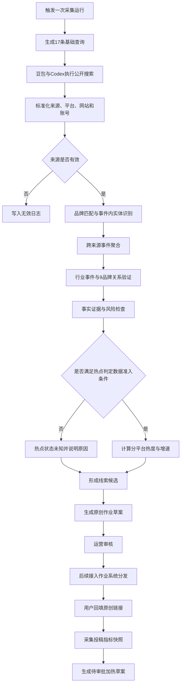
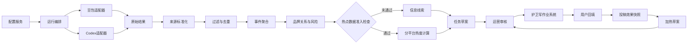

# AI热点发现与护卫军作业联动产品需求文档

| 项目 | 内容 |
|---|---|
| 文档版本 | v0.2 |
| 文档日期 | 2026-09-04 |
| 文档状态 | 待产品、运营、研发评审 |
| 目标用户 | 护卫军运营、内容运营、产品管理员、研发运维、护卫军用户 |
| 业务目标 | 识别具体平台正在快速发酵的东风相关事件，形成原创作业并按用户擅长平台分发，依据投稿效果触发后续加热 |
| 本阶段目标 | 在尚未具备稳定热点数据源的前提下，验证公开信息线索发现、证据核验、事件研判、任务草案和投稿效果回流链路；本阶段达标不等于具备真实热点监测能力 |
| 保密要求 | API Key、Token、Cookie及个人敏感信息不得写入文档、配置、日志或模型输入 |

---

# 1. 执行摘要

## 1.1 问题定义

业务要求系统回答两个问题：

1. 哪个平台、哪个东风相关事件正在快速发酵，是否值得在有效时间内组织护卫军响应。
2. 护卫军原创内容发布后是否出现传播增长，是否需要进一步组织点赞、评论等加热作业。

## 1.2 问题拆解与业务闭环

围绕上述两个业务问题，将业务规划拆为五个连续环节。每个环节既对应一个业务判断，也对应后续产品能力：

| 问题拆解 | 需要回答的问题 | 对应产品设计 |
|---|---|---|
| 发现 | 哪些平台出现了新的东风相关内容和讨论 | 持续采集或检索、来源标准化、平台与账号识别 |
| 判断 | 多条内容是否属于同一事件，事件是否正在发酵 | 无效过滤、转载去重、事件聚合、热点数据准入与分平台趋势计算 |
| 决策 | 事件是否与东风相关、是否值得响应、有哪些表达风险 | 品牌关系、实体存疑原因、事实证据、风险提示和运营复核 |
| 执行 | 应生成什么原创作业、发给哪些擅长该平台的成员 | 原创作业草案、运营审批、平台能力标签匹配和正式分发 |
| 反馈 | 投稿是否起量、是否需要继续组织加热 | 用户回填链接、效果快照、分平台增量判断和加热作业草案 |

完整业务闭环如下：

```text
平台内容持续发现
→ 来源清洗与事件聚合
→ 热点判定或公开信息线索识别
→ 东风关联与风险研判
→ 生成原创作业草案
→ 运营审批
→ 按用户擅长平台分发
→ 用户发布并回填链接
→ 多次采集投稿效果
→ 达到分平台条件时生成加热作业草案
```

## 1.3 分阶段方案

产品分为两个连续阶段：

| 阶段 | 数据基础 | 解决的问题 | 输出 |
|---|---|---|---|
| 公开信息线索与作业联动PoC | 豆包、Codex公开搜索、可访问网页及用户回填后的现有效果采集 | 公开线索能否被清洗、聚合和研判，能否形成有证据的原创作业草案，并在非微信平台验证投稿效果增量和加热草案链路 | 相关事件线索、品牌内容机会、人工复核项、原创作业草案、投稿效果增量、加热作业草案 |
| 真实热点能力 | 稳定的平台原生数据或专业舆情数据源 | 哪个平台、哪个事件正在快速发酵，是否达到响应时机 | 分平台热点状态、增速、风险等级、响应建议 |

两阶段共用来源标准化、事件聚合、品牌关联、风险判断、任务草案、运营审核、投稿回填和效果跟踪能力。

## 1.4 关键判断

1. **公开搜索可以帮助发现公开信息线索，但不能独立证明真实热点。**真实热点仍需平台原生内容、互动量、短时增速、独立作者/UGC规模、账号影响力和覆盖审计。
2. **AI可以承担证据整理、事件聚合辅助、风险提示和作业草案生成，但不能替代运营作出高风险事实判断和正式发布决策。**
3. **项目现有采集能力可以支持后置效果验证。**用户回填原创链接后，除公众号、视频号外，可按平台采集部分点赞、评论等基础指标，并通过连续快照判断增量、生成加热草案。
4. **自动化联动是后续目标，但本阶段不预设必须建设MCP。**系统联动可采用标准数据/事件推送，由护卫军业务系统按既定规则消费并生成作业；也可采用受控MCP工具调用。两种方式都必须复用同一数据契约、审批、权限和审计规则。

## 1.5 阶段一与业务期望对照

阶段一只验证现有搜索、AI分析、护卫军业务能力和投稿效果采集能够支撑的部分，不把未具备的数据能力包装成已实现。

| 业务规划步骤 | 业务期望 | 阶段一能做到 | 与业务期望的差距及结论 |
|---|---|---|---|
| 持续监测目标平台 | 持续发现微博、抖音等平台出现的新内容和新增讨论 | 按9个品牌、8个行业主题触发豆包与Codex公开搜索，召回被公开收录的信息 | 搜索不是平台持续采集，覆盖范围和收录延迟不可控；**不能承诺发现目标平台的全部热点** |
| 判断哪里正在发酵 | 根据平台原生互动量、短时增速、独立作者/UGC规模判断具体平台和事件的热度变化 | 核验公开页面、发布时间、来源证据和事件更新，形成相关事件线索 | 缺少未知链接前的平台原生指标、连续快照和覆盖审计；**不能输出真实热点评级、增速或预警** |
| 判断是否与东风相关、是否值得响应 | 识别品牌、车型、人物和事件关系，判断风险与行动价值 | 完成来源清洗、事件聚合、东风关联、风险提示和人工复核分流 | **可以验证**；但高风险事实、存疑实体和最终行动决策必须由运营审核 |
| 自动生成原创作业 | 热点达到响应条件后自动形成原创任务 | 基于已核验证据生成原创评论或原创内容作业草案，并附事实依据、风险说明、建议平台和禁止表述 | **可以验证草案质量，不能自动发布**；是否创建正式作业仍由运营审批 |
| 按成员擅长平台分发 | 根据平台能力标签选择目标人群并下发 | 复用现有平台能力标签形成建议人群和分发快照 | **可以验证匹配逻辑**；真实下发依赖标签与作业接口联调，并保留人工审批 |
| 监测投稿起量并触发加热 | 监测原创内容传播增长，对起量内容继续组织点赞、评论等加热 | 用户回填已知链接后，非微信平台可采集部分点赞、评论等基础指标；通过多次快照计算分平台增量并生成加热草案 | **可以验证非微信平台的后置加热链路**；公众号、视频号暂以人工凭证处理，加热草案不得自动发布 |

阶段一对外称为“公开信息线索与作业联动PoC”。达标表示线索研判、原创草案和非微信投稿效果加热链路可行；不表示已经具备全平台持续发现或真实热点判定能力。

## 1.6 本阶段SMART目标

| 维度 | 要求 |
|---|---|
| 具体 | 对9个业务品牌及8个行业主题执行公开搜索，完成来源核验、事件聚合、品牌关联、风险提示和原创作业草案；用户回填后验证非微信平台效果增量与加热草案 |
| 可衡量 | 每次运行生成17条基础查询、34个双路搜索任务；记录查询覆盖率、来源完整率、自动过滤误杀率、事件聚合准确率、候选通过率、已知线索漏检率和人工审核时长 |
| 可实现 | 使用现有豆包搜索、Codex公开搜索、规则处理、人工审核及已知链接效果采集能力完成；公众号和视频号效果以人工凭证兜底 |
| 相关 | 验证业务终局中的信息发现、事件研判、原创任务生成和后置效果加热链路，并量化真实热点数据源缺口 |
| 有时限 | 10个工作日完成：配置冻结1天、连续运行7天、数据汇总2天；不在本阶段建设生产定时任务和7×24监控 |

## 1.7 成功标准

1. 基础查询覆盖率为100%，未执行、失败、无结果必须分别记录。
2. 有效来源必填字段完整率为100%；缺失发布时间、账号或正文时必须显式说明。
3. 公开搜索产生的事件100%不得输出真实热点评级，并必须说明不可判定原因。
4. 明确无效来源不进入运营候选主列表；误杀率目标在PoC样本完成后标定为`[TBD]`。
5. 每个任务草案均包含品牌关系、事实证据、风险说明、建议平台和禁止表述。
6. 事件聚合准确率、候选通过率、人工已知线索漏检率和人工审核时长形成可复算基线，目标值在首轮样本后标定。
7. 非微信平台投稿至少形成两个有效指标快照后才能计算增量；公众号、视频号必须进入人工凭证流程。

---

# 2. 用户体验与功能

## 2.1 用户角色

### 运营审核人

- 查看信息线索、事件证据、品牌关系、风险和AI建议。
- 决定通过、修改后通过、驳回或继续观察。
- 审批原创作业草案和加热作业草案。

### 内容运营

- 补充官方事实、素材和允许使用的表达。
- 选择评论、原创内容或后续加热的作业方向。
- 确认目标平台和禁用表述。

### 产品管理员

- 维护品牌范围、品牌别名、查询目录、来源规则和业务规则版本。
- 发布、停用和回溯配置版本。

### 研发运维

- 维护采集适配器、规则处理、数据存储和业务接口。
- 处理失败重试、运行监控、数据审计和告警。

### 护卫军用户

- 接收与自身擅长平台匹配的原创作业。
- 发布内容并回填真实平台链接或人工凭证。

## 2.2 核心用户流程



## 2.3 功能需求

### F01 配置管理

系统必须管理以下配置：

1. 业务品牌和品牌别名。
2. 来源平台、网站、域名和官方账号。
3. 品牌查询、行业主题查询和关联补采查询。
4. 自动无效过滤、URL规范化、去重和事件聚合规则。
5. 事件级实体判断、品牌关系、风险和候选分类规则。
6. 热点判定数据准入条件和分平台热度模型。
7. 任务草案、平台推荐、投稿效果和加热规则。
8. 输出字段、枚举和数据保留规则。

所有配置必须具备版本号、生效时间、修改人、修改原因、草稿/已发布/已停用状态。新运行使用最新已发布版本，历史运行保留原版本，禁止修改已被运行引用的配置版本。

### F02 查询任务生成

每次完整运行必须生成：

- 9条品牌基础查询。
- 8条行业主题查询。
- 每条基础查询分别由豆包和Codex执行，共34个基础搜索任务。

运行前生成查询覆盖清单。运行后记录每个任务的成功、失败、无结果和未执行状态。未执行不得解释为无结果。

行业主题结果不能直接归属品牌。每个有效行业事件必须分别验证与9个启用品牌的关系，不轮换、不抽样。

### F03 公开搜索接入

豆包负责公开网页广召回，Codex负责补充召回、打开可访问页面和核验正文。两个搜索来源使用同一查询目录，但分别记录请求状态、返回时间、结果顺序和原始响应引用。

搜索排序、搜索结果数和供应商权威等级只作为原始搜索字段保留，不得进入热度计算。

单一搜索来源失败时继续执行另一来源；两个来源均失败时运行标记为部分失败并支持重试。

### F04 来源标准化

每条来源统一输出：

- 采集来源、查询ID和运行ID。
- 来源平台、网站名称、发布账号及账号链接。
- 原始URL、规范化URL、标题、摘要、正文。
- 发布时间、事件时间、首次发现时间和采集时间。
- 发布者类型、是否官方、是否转载及重复来源ID。

无法识别平台或账号时保持未知状态并说明原因，禁止AI补造。只有已确认域名或账号可标记为官方来源。

### F05 自动无效过滤

以下数据经确定性规则确认后直接进入无效日志，不进入人工候选：

- 无有效URL且无法获得可核验证据。
- 同名误匹配且与汽车或目标品牌无关。
- 纯招标、采购、招聘、组织任免或内部行政信息。
- 纯经销商报价、优惠和到店引流。
- 超过72小时且没有新增事实、新回应或传播变化的旧闻。
- 品牌导航页、百科页、常驻产品页等没有新增事件的页面。
- 完成9品牌关系验证后仍与目标品牌无关的行业事件。

无效日志必须记录命中规则、原因、处理时间和原始来源，支持运营抽检和恢复误过滤数据。

### F06 去重与事件聚合

1. 同一规范化URL只生成一个来源记录，合并采集器和查询ID。
2. 正文指纹相同的内容保留一条主记录，其他记录标记为重复。
3. 同一原始发布主体的跨站转载只计一个独立事实来源。
4. 事件按主体、动作、对象和事件日期聚合。
5. 同一列表页包含多个业务动作时必须拆为多个事件。
6. 事件更新仍挂在原事件下，并标记新增事实或新增回应。

来源数和独立来源数只表示证据广度，不表示平台热度或用户讨论规模。

### F07 品牌与事件内实体判断

品牌及品牌别名是需要长期维护的主数据。只有`active`品牌及其精确别名可以形成确定性品牌匹配；弱别名必须同时满足汽车上下文。

车型、人物、活动和机构不要求维护完整清单，由AI在具体事件中识别：

| 判断结果 | 系统处理 |
|---|---|
| 名称、身份和品牌关系有可访问证据支持，且证据无冲突 | 写入当前事件的`entity_mentions`并保留证据 |
| 疑似新车型、新活动、身份冲突、同名歧义、正文无法核验或仅有单一弱来源 | 写入`entity_uncertainties`，记录不确定原因、建议关系和证据来源，事件进入人工复核 |
| 人工确认或修改 | 只更新当前事件结论，不自动写回全局实体主数据 |

实体存疑不能自动证明事件与品牌有关，也不能单独导致事件无效。

### F08 品牌关系验证

品牌关系状态包括：

| 状态 | 定义 | 后续处理 |
|---|---|---|
| `direct_mention` | 原始内容直接命中启用品牌 | 继续证据与风险判断 |
| `verified_relation` | 关联补采找到可访问的品牌关系证据 | 继续证据与风险判断 |
| `unresolved` | 存在疑似关系，但事实、实体或时间证据不足 | 人工复核 |
| `no_relation` | 完整验证后仍无品牌关系证据 | 自动进入无效日志 |

AI只能提出关系建议；最终状态由品牌字典、来源证据和确定性规则共同生成。

### F09 热点判定数据准入规则

“热点判定数据准入规则”是系统输出真实热点结论前必须通过的数据条件检查。它不是对事件价值的判断，也不代表数据未通过就必须丢弃。

只有同时满足以下条件，系统才允许计算`normal/rising/breaking/sustained/declining`等热点状态：

1. 能识别来源平台和平台内容ID。
2. 能获得该平台原生播放、阅读、点赞、评论、分享或收藏等指标。
3. 同一内容或事件存在连续指标快照，可计算明确时间窗口内的增量和速度。
4. 能区分独立作者或新增UGC，避免把同源通稿转载当成用户讨论。
5. 数据源提供覆盖范围、采集时间、延迟、失败和漏采说明，可审计追溯。

任一条件不满足时：

```json
{
  "hotspot_judgement_available": false,
  "hotspot_status": "unknown",
  "hotspot_unavailable_reason": [
    "缺少平台原生互动指标",
    "缺少连续指标快照",
    "无法说明平台覆盖范围"
  ]
}
```

未通过准入的数据仍可形成“相关事件线索”或“品牌内容机会”，并生成需要运营审核的任务草案；但不得表述为“正在爆发”“平台热点”，也不得以热点为依据自动下发作业。

### F10 风险判断与人工复核

以下情况必须进入人工复核：

- 事故、安全、召回、销量、价格、监管、竞品比较或高阶智能驾驶表述。
- 负面风险词与弱信源、绝对化断言或事实冲突同时出现。
- 只有单一二手来源但可能具有响应价值。
- 品牌关系、车型、人物身份、事件时间或事实存在不确定项。
- AI无法提供完整证据、输出明确不确定项或结构校验失败。

风险词只用于召回和提高复核优先级，不能单独构成负面、抹黑或事实结论。AI不得解除高风险状态。

### F11 候选分类

| 分类 | 进入条件 | 可否生成任务草案 |
|---|---|---|
| 相关事件线索 | 72小时内、有品牌关系和可访问证据、具备原创响应价值、无未解除高风险 | 可以 |
| 品牌内容机会 | 24小时内、来自已确认官方来源、有明确新增事实、适合主动传播 | 可以 |
| 人工复核 | 命中高风险、事实冲突、品牌关系或事件实体存疑 | 复核通过后可以 |
| 持续观察 | 时间缺失、证据不足或暂不满足任务条件 | 不可以 |

分类是运营处理优先级，不是热点等级。

### F12 原创作业草案生成

任务草案支持：

- 原创评论。
- 原创内容。
- 后续加热观察。

草案至少包含事件ID、任务类型、任务标题、事实背景、原创方向、建议平台、目标用户标签、证据来源、风险说明和禁止表述。

草案只能引用已经核验的事实。PoC阶段仅保存`draft_pending_review`，不自动创建正式作业、不自动发布、不自动触达用户。

### F13 运营审核

运营可以：

- 查看事件、来源、平台、账号、时间、品牌关系和不确定项。
- 查看AI摘要、事实证据、风险和补采结果。
- 修改任务类型、平台、目标标签、截止时间和表达边界。
- 选择通过、修改后通过、驳回或观察。

所有操作必须记录审核人、时间、结论、原因和修改前后内容。

### F14 按擅长平台分发

进入系统联动阶段后，任务草案根据用户现有平台能力标签匹配目标人群。平台推荐综合事件来源平台、内容形态、任务目标和用户标签，不能把来源平台直接等同于建议发布平台。

系统生成目标人群快照并保留频控、配额和排除原因。自动发布保持关闭，待业务确认审批责任和接口后开放。

### F15 投稿回填与效果跟踪

用户完成原创作业后必须回填实际发布平台和内容链接。

- 同一用户、任务和规范化URL只保留一条有效投稿。
- 抖音、快手、微博、今日头条、小红书、知乎、B站、易车、懂车帝和汽车之家按现有能力采集可获得的部分基础指标。
- 公众号、视频号当前进入人工凭证流程，不参与自动增量判断。
- 不同平台使用各自可采字段，缺失指标保持`null`并记录原因，不得按0处理。
- 同一投稿至少保存两个有效快照后才计算增量。
- 达到该平台待确认阈值时只生成加热作业草案，必须由运营审批。

## 2.4 用户故事与验收标准

### US01 触发完整运行

作为运营，我希望一次运行覆盖全部品牌和行业主题，以便区分“没有结果”与“没有执行”。

验收标准：

- 运行前显示17条基础查询和34个搜索任务。
- 每个任务显示成功、失败、无结果或未执行。
- 任一缺失查询均产生明确告警。

### US02 查看统一事件

作为运营，我希望按事件而不是按搜索链接审核，以便快速理解事实和证据。

验收标准：

- 一个事件展示全部来源、平台、账号、时间和转载关系。
- 展示独立来源数但不将其解释为热度。
- 展示品牌关系、事件实体、不确定原因和风险。

### US03 审核任务草案

作为运营，我希望基于证据修改并审批原创作业草案，以便快速响应且不突破事实边界。

验收标准：

- 草案包含证据、风险和禁止表述。
- 未解除高风险或实体存疑的事件不能直接通过。
- 审批形成完整审计记录。

### US04 回填原创链接

作为护卫军用户，我希望提交实际发布链接，以便系统跟踪传播效果。

验收标准：

- 链接必须属于任务允许的平台。
- 非微信平台进入自动指标采集；微信系提示上传人工凭证。
- 保存原始URL、规范化URL、提交时间和平台识别结果。

### US05 审核加热草案

作为运营，我希望根据同一投稿的指标增量获得加热建议，以便优先放大已经出现增长的优质内容。

验收标准：

- 至少两个有效快照才计算增量。
- 展示基线值、当前值、增量、时间窗口、命中规则和缺失字段。
- 加热草案必须审批后才能进入正式作业流程。

## 2.5 产品页面

| 页面 | 核心内容 |
|---|---|
| 运行中心 | 查询覆盖、采集器状态、成功/失败/未执行、耗时和重试 |
| 信息线索工作台 | 相关事件线索、品牌内容机会、人工复核、持续观察 |
| 事件详情 | 来源证据、平台账号、时间、品牌关系、实体不确定项、风险和审核记录 |
| 配置管理 | 品牌、来源、查询、过滤、聚合、风险、热点准入、任务和效果规则 |
| 无效日志 | 自动过滤规则、来源、恢复操作和抽检结果 |
| 任务草案与审批 | 原创方向、目标平台、用户标签、证据、风险和审批 |
| 投稿效果与加热审批 | 回填链接、指标快照、增量、缺失原因和加热草案 |

## 2.6 非目标范围

本阶段不建设：

- 绕过平台登录、验证码、付费墙或反爬机制的采集。
- 依靠公开搜索承诺抖音、微博、小红书、公众号或视频号的完整覆盖。
- 根据搜索排序、搜索结果数、转载数或AI主观分判断真实热点。
- 自动发布、自动评论、自动点赞、自动投流或未经审批自动下发正式作业。
- 在证据不足时把车型、人物、活动或品牌关系写成确定事实。
- 跨平台直接比较播放、阅读或互动绝对值。
- 将具体风险词直接认定为负面事实或恶意攻击。

---

# 3. AI系统要求

## 3.1 AI职责

AI可以：

- 从标题、摘要和正文提取品牌、车型、人物、活动、机构、动作、对象和时间。
- 识别可能描述同一事件的来源，供聚合规则或人工确认。
- 汇总已核验证据、事实冲突和证据缺口。
- 生成关联补采查询和原创作业草案。
- 对文本风险提供标签和理由。

AI不可以：

- 把搜索结果数量、排序或转载数转换为热点等级。
- 补造来源URL、发布时间、平台账号、互动数据或品牌关系。
- 把新车型、人物或活动自动写入全局主数据。
- 仅凭风险词认定负面事实。
- 自动解除高风险状态。
- 直接控制正式作业发布。

## 3.2 确定性规则职责

以下能力必须由代码或规则引擎执行：

- 查询覆盖、状态枚举和配置版本校验。
- URL规范化、确定性无效过滤和精确去重。
- 热点判定数据准入条件检查。
- 数值增量、时间窗口、阈值和频控计算。
- JSON结构校验、字段类型校验和最终序列化。

AI输出必须经过结构校验，不得让生成式模型承担机器可解析结果的字符级透传。

## 3.3 AI输出契约

事件提取至少包含：

```json
{
  "brand_matches": [],
  "entity_mentions": [],
  "entity_uncertainties": [
    {
      "entity_type": "model",
      "entity_name_raw": "原文名称",
      "uncertainty_reason": "无法确认是否为正式车型名称",
      "proposed_relation": {"brand_id": "BR003"},
      "evidence_source_ids": ["SRC001"]
    }
  ],
  "event_action": "事件动作",
  "event_object": "动作对象",
  "event_at_raw": "原始时间文本",
  "risk_tags": [],
  "factual_evidence": []
}
```

品牌ID由规则层根据品牌配置确认。`entity_uncertainties`非空时事件进入人工复核。

## 3.4 工具与数据源要求

| 能力 | 本阶段 | 生产要求 |
|---|---|---|
| 公开网页召回 | 豆包公开搜索 | 作为辅助线索，不承担热点SLA |
| 页面核验和补充召回 | Codex公开搜索与页面读取 | 作为证据核验，不承担全平台采集SLA |
| 未知内容持续发现 | 不具备 | 专业平台数据或合规采集服务 |
| 已知投稿链接效果 | 项目现有非微信平台基础指标采集 | 正式接口、鉴权、更新机制、错误码和SLA |
| 微信系效果 | 人工凭证 | 授权数据源或继续人工兜底 |
| 业务系统联动 | PoC不接正式下发，仅冻结事件与作业候选数据契约 | 后续在“标准数据/事件推送”与“受控MCP工具调用”之间选型；业务系统保留作业规则、审批和发布控制 |

## 3.5 评估策略

连续运行7天形成标注集，并评估：

1. 来源有效/无效分类准确性和误杀率。
2. 来源平台、网站和账号识别准确性。
3. 品牌匹配、弱别名误匹配和事件实体不确定原因完整性。
4. 事件误合并率和漏合并率。
5. 品牌直接关系、验证关系、无关系和存疑关系准确性。
6. 高风险事件漏拦截率。
7. 运营通过、修改后通过、驳回和观察比例。
8. 草案事实一致性、证据完整性和平台可执行性。
9. 搜索来源是否100%保持热点不可判定，页面和导出是否存在误导表述。

---

# 4. 技术规格

## 4.1 系统架构

本方案将配置编排、来源标准化、过滤去重、事件聚合、AI研判、热点数据准入和任务草案生成统称为“线索与热点处理引擎”。它是护卫军方案内部的处理组件，不按独立中台建设；“处理规则”只是引擎中负责确定性过滤、计算和状态流转的一部分。



## 4.2 核心数据对象

| 数据对象 | 用途 |
|---|---|
| `collection_run` | 一次运行及查询覆盖、配置版本、采集器汇总 |
| `raw_provider_result` | 采集器原始响应引用、状态和耗时 |
| `source_item` | 标准化来源、平台、账号、URL、正文、时间和证据属性 |
| `invalid_log` | 自动过滤规则、原因和原始来源 |
| `event` | 统一事件、品牌关系、事件实体、风险、热点可判定性和候选状态 |
| `candidate_review` | 运营审核结论、原因和修改记录 |
| `task_draft` | 待审批任务草案及关联证据 |
| `task_submission` | 用户回填平台、链接和采集状态 |
| `platform_metric_snapshot` | 投稿在单个时间点的分平台指标 |
| `submission_metric_delta` | 同一投稿多个快照之间的可用指标增量 |
| `event_timeseries` | 生产数据源阶段的事件级内容量、作者量、互动增量和速度 |

## 4.3 状态流转

### 来源状态

```text
collected
├── valid → normalized → clustered
├── invalid → invalid_log
└── fetch_failed → retrying → valid / fetch_failed_final
```

### 事件状态

```text
created
→ relation_check
→ evidence_check
→ hotspot_data_readiness_check
→ relevant_event_clue / brand_content_opportunity / manual_review / watch
```

### 热点状态

```text
未通过数据准入：unknown
通过数据准入：normal / rising / breaking / sustained / declining
```

### 任务草案状态

```text
draft_pending_review
→ approved_pending_publish / cancelled
→ published（系统联动阶段）
```

## 4.4 接口要求

| 接口 | 用途 | 阶段 |
|---|---|---|
| `POST /api/hotspot-runs` | 触发一次完整运行 | PoC |
| `GET /api/hotspot-runs/{run_id}` | 查询覆盖、采集器状态和处理进度 | PoC |
| `GET /api/hotspot-candidates` | 查询事件候选 | PoC |
| `GET /api/hotspot-events/{event_id}` | 查看事件证据和判断依据 | PoC |
| `POST /api/hotspot-candidates/{candidate_id}/review` | 提交候选审核 | PoC |
| `POST /api/hotspot-events/{event_id}/entity-uncertainties/review` | 审核当前事件中的实体不确定项 | PoC |
| 标签查询接口 | 按平台能力标签查询人群 | 系统联动阶段 |
| 作业草案、审批和发布接口 | 创建并发布已经审批的正式作业 | 系统联动阶段 |
| 投稿回填和效果接口 | 接收链接、查询快照和加热结果 | 系统联动阶段 |

接口必须支持幂等、鉴权、错误码、请求ID、配置版本和审计日志。

## 4.5 自动化联动方案（待选型）

系统联动阶段的目标是减少人工搬运，使已审核的事件和作业候选进入护卫军正式作业链路。当前不预设必须建设MCP，后续根据现有系统接口、权限体系、实施成本和审计要求选择联动方式。

| 联动方式 | 工作方式 | 适用条件 | 主要约束 |
|---|---|---|---|
| 标准数据/事件推送（优先评估） | 线索与热点处理引擎输出标准事件和`task_candidate`；推送给护卫军或由护卫军主动拉取；护卫军按已定义的业务规则生成作业草案并进入审批 | 护卫军已有任务规则与接口，强调系统解耦、稳定传输和确定性处理 | 必须定义幂等键、消息版本、重试、回执、失败队列和审计记录 |
| 受控MCP工具调用（候选方案） | 自动化任务通过经批准的工具查询候选与证据、查询平台标签、提交作业候选并读取处理状态 | 后续需要对话式编排或一次流程跨多个内部能力调用 | 工具定义、凭证、写入权限和审计必须受控；不得绕过运营审批，不承担外部平台采集 |

两种联动方式共用同一份事件与作业候选数据契约。护卫军业务系统始终负责作业生成规则、审批、频控、正式发布和结果回执；AI只生成候选与建议，不直接写入正式发布状态。

PoC阶段不实施上述自动化联动，只通过标准化导出或人工录入验证候选质量，并冻结后续联调所需的数据字段。

## 4.6 安全与合规

- 只处理公开网页和业务授权数据。
- 禁止绕过登录、验证码、付费墙和反爬机制。
- 密钥只保存在环境变量或密钥管理服务。
- 原始响应和日志必须脱敏Authorization、Cookie、Token和个人数据。
- 普通用户个人信息不得进入搜索或LLM分析链路。
- 原始数据保留周期为`[TBD]`，上线前由业务、信息安全和法务确认。

## 4.7 可用性与可观测性

每次运行至少记录：

- 查询总量、成功、失败、无结果和未执行数量。
- 各采集器耗时、重试、错误和结果数量。
- 自动过滤数量、规则分布和抽检结果。
- 事件聚合、拆分、品牌关系和不确定项数量。
- 热点数据准入通过/未通过及具体原因。
- 候选分类、任务草案、运营审核和处理耗时。
- 投稿链接解析、快照采集、增量计算和加热草案结果。

生产阶段的性能、可用性和恢复目标为`[TBD]`。

---

# 5. 风险与路线图

## 5.1 分阶段计划

### 阶段一：10个工作日公开信息线索与作业联动PoC

范围：

- 每日人工触发17条基础查询和双路公开搜索。
- 对有效行业事件执行9品牌关系验证。
- 生成任务草案但不下发。
- 运营标注通过、修改后通过、驳回和观察。
- 选取非微信平台投稿验证链接回填、快照、增量和加热草案。

完成标准：形成查询覆盖、线索漏检、自动过滤、事件聚合、候选质量、人工耗时和投稿效果链路的基线；不输出热点识别准确率。

### 阶段二：生产数据源与真实热点PoC

范围：

- 选择一个业务优先平台和候选数据源。
- 验证平台内容ID、原生互动指标、独立作者/UGC标识、连续快照和覆盖说明。
- 按平台计算1小时、3小时和24小时增量与速度。
- 与运营人工判断进行样本对照。

完成标准：数据源通过热点判定数据准入条件，形成该平台热度模型、覆盖边界和SLA结论。未通过时不得进入自动热点阶段。

### 阶段三：护卫军半自动联动

- 读取现有平台能力标签并生成目标人群快照。
- 在标准数据/事件推送与受控MCP工具调用之间完成选型和联调。
- 将已审核的事件与作业候选交给护卫军；由护卫军按业务规则生成作业草案，审批后创建正式原创作业。
- 保留运营发布、敏感内容和高风险事件的人工审批。

### 阶段四：效果回流与加热规模化

- 稳定采集非微信平台投稿效果。
- 确认公众号、视频号自动数据源或长期人工方案。
- 配置分平台增量阈值、频控和奖励规则。
- 审批后生成并发布加热作业。

## 5.2 主要风险

| 风险 | 影响 | 控制措施 |
|---|---|---|
| 把搜索结果误报为热点 | 错误决策和错误下发 | 强制热点判定数据准入规则；搜索来源热点状态固定为unknown |
| 搜索漏掉平台内高传播内容 | 线索漏检 | 用人工已知样本衡量漏检；生产阶段接入稳定平台数据源 |
| 同一通稿大量转载 | 虚增证据或传播规模 | 转载识别和独立发布主体去重 |
| 新车型、人物或活动证据不足 | 品牌归属和事实错误 | 记录不确定原因并随事件人工审核 |
| 风险词被当作事实 | 误伤正常投诉或制造舆情风险 | 风险词只做召回；必须结合主体、断言、证据和语境判断 |
| 高风险内容被AI直接放行 | 品牌与合规风险 | 高风险强制人工，AI不得解除 |
| 不同平台指标口径不同 | 加热判断失真 | 分平台配置指标和阈值，禁止统一绝对值比较 |
| 配置频繁变化 | 结果不可复算 | 配置版本冻结、运行绑定版本、历史不回写 |
| 生成式输出破坏结构 | 数据无法解析 | 规则层校验、确定性序列化和回归测试 |

## 5.3 依赖项

### 本阶段依赖

- 豆包公开搜索和Codex公开搜索。
- 9个业务品牌及品牌别名。
- 运营人工审核人员。
- 已知投稿链接的非微信平台基础指标采集能力。

### 系统联动依赖

- 平台能力标签接口和枚举。
- 统一事件与作业候选数据契约。
- 标准数据推送/拉取接口或受控MCP工具，以及对应的鉴权、幂等、重试、回执和审计机制。
- 护卫军侧作业生成规则、草案、审批、发布和结果接口。
- 投稿回填、效果快照和加热结果接口。
- 权限、审计、频控和通知机制。

### 真实热点依赖

- 未知内容持续发现和平台原生数据源。
- 平台内容ID、原生互动指标和连续快照。
- 独立作者或UGC标识、覆盖说明、采集延迟和SLA。

## 5.4 待确认事项

| 事项 | 当前口径 | 确认方 |
|---|---|---|
| 真实热点优先验证平台 | `[TBD]` | 业务/运营 |
| 生产数据源采购或授权方式 | `[TBD]` | 业务/采购/信息技术部 |
| 分平台热度阈值 | 数据源样本标定后确定 | 业务/运营 |
| 分平台加热阈值和奖励 | `[TBD]` | 业务/运营 |
| 高风险事件最终审批人 | 运营，具体角色待确认 | 业务 |
| 公众号、视频号效果方案 | 当前人工凭证 | 业务/信息技术部 |
| 自动化联动方式 | 标准数据/事件推送优先评估，MCP作为候选方案 | 产品/信息技术部/研发 |
| 数据保留周期 | `[TBD]` | 业务/信息安全/法务 |

---

# 6. 配置项业务说明

## 6.1 品牌与别名

- 当前业务范围为9个品牌：东风汽车、东风风神、岚图汽车、猛士汽车、东风奕派、东风日产、东风本田、东风标致、东风雪铁龙。
- 精确别名可直接匹配；“东风”“猛士”等弱别名必须同时出现汽车上下文。
- 新增或停用品牌会改变基础查询数量和行业事件关联任务数量，只对新运行生效。

## 6.2 来源平台、网站与账号

- 来源规则用于识别平台、网站、发布账号和官方身份。
- 只有业务确认的域名或账号可标记官方；搜索供应商的权威等级不能替代官方身份。
- 平台或账号不可识别时保持未知并说明原因。
- 新增来源规则会影响平台统计、官方判断和风险优先级。

## 6.3 查询目录

- 9条品牌查询和8条行业主题查询全部执行，不轮换、不抽样。
- 豆包与Codex使用同一基础目录，便于比较召回差异。
- 行业事件必须执行9品牌关系验证后才能形成品牌结论。
- 查询新增、停用或修改必须记录版本和原因。

## 6.4 自动过滤、去重与事件聚合

- 自动过滤只处理证据明确的技术无效数据，不处理业务价值否决。
- 同URL、同正文和同源转载分别处理，避免重复展示和虚增独立来源。
- 事件聚合保留所有原始来源，支持人工拆分和合并。

## 6.5 热点判定数据准入

- 该配置决定系统是否有资格输出真实热点状态。
- 必填能力包括平台内容ID、原生指标、连续快照、独立作者/UGC标识和覆盖审计信息。
- 未通过时必须输出`unknown`及逐项原因，仍可进入信息线索审核。
- 准入条件由产品和研发维护，业务确认其对外解释口径；不得由运营临时修改为“搜索结果也可判热点”。

## 6.6 风险与候选分类

- 风险配置只决定是否提高复核优先级或强制人工，不直接判定事实真假。
- 候选分类决定运营工作台分栏和是否允许生成草案，不代表热点等级。
- 高风险规则变更必须由指定管理员发布并保留审计记录。

## 6.7 作业、平台推荐与效果加热

- 草案必须关联事件、证据、风险和建议平台。
- 目标人群使用现有平台能力标签，不在本项目新建另一套平台标签体系。
- 投稿效果按平台分别配置可采字段、快照窗口和阈值。
- 加热结果只生成待审批草案，不自动发布。

## 6.8 配置责任矩阵

| 配置 | 初始录入 | 业务确认 | 技术校验 | 发布权限 |
|---|---|---|---|---|
| 品牌及品牌别名 | 产品 | 运营 | 研发 | 产品管理员 |
| 官方域名和账号 | 产品 | 运营/品牌方 | 研发 | 产品管理员 |
| 查询目录 | 产品 | 运营 | 研发 | 产品管理员 |
| 自动过滤和事件聚合 | 产品 | 运营 | 研发/测试 | 产品管理员 |
| 事件内实体判断 | 产品 | 运营 | 研发/测试 | 产品管理员 |
| 热点判定数据准入 | 产品/研发 | 业务/运营 | 研发/测试 | 指定管理员 |
| 风险与候选分类 | 产品 | 业务/运营 | 研发/测试 | 指定管理员 |
| 平台标签与分发 | 产品 | 运营 | 研发 | 指定管理员 |
| 效果加热和奖励 | 业务 | 运营 | 产品/研发 | 指定管理员 |

---

# 7. 验收测试场景

## AT01 查询覆盖

给定9个启用品牌和8个启用主题，运行后必须生成17条基础查询、34个双路搜索任务；任一未执行任务必须单独显示。

## AT02 搜索结果不得判为热点

仅有公开搜索标题、摘要和URL时，事件必须输出`hotspot_status=unknown`，并列出缺少的平台原生指标、连续快照或覆盖信息。

## AT03 存疑车型随事件审核

来源出现疑似新车型，但无法确认是否为正式名称时，保留原文和证据，写明不确定原因，事件进入人工复核；不得自动新增全局车型主数据。

## AT04 弱别名误匹配

内容只出现普通语义“东风”且没有汽车上下文时，不得匹配东风汽车品牌。

## AT05 双路同URL去重

豆包和Codex返回同一规范化URL时，只创建一个来源记录，并同时保留两个采集来源和查询ID。

## AT06 聚合页拆事件

一个列表页包含多个独立业务动作时，必须拆成多个事件，并保留同一来源作为证据。

## AT07 旧闻自动过滤

超过72小时且没有新增事实、新回应或传播变化的内容进入无效日志，不进入运营候选。

## AT08 行业事件品牌验证

行业事件未直接出现目标品牌时，必须执行9品牌关系验证；全部无证据时自动进入无效日志。

## AT09 风险词不能单独定性

内容仅出现风险词但语境可能为中性、正面或正常投诉时，不得直接判定负面攻击，必须结合证据和语境处理。

## AT10 高风险人工复核

事故、安全、召回、销量、价格、监管、竞品或高阶智驾事件不得由AI自动解除风险。

## AT11 草案证据要求

缺少品牌关系、事实证据、风险说明、建议平台或禁止表述时，不得生成可审批任务草案。

## AT12 非微信平台效果增量

用户回填非微信平台链接后，只有形成至少两个有效指标快照才能计算增量；缺失字段保持`null`。

## AT13 微信系人工兜底

公众号、视频号投稿不得进入自动指标增量判断，必须进入人工凭证流程。

## AT14 加热草案审批

达到分平台增量条件时只生成待审批加热草案，未经运营审批不得创建正式加热作业。

## AT15 配置版本可追溯

任一运行、候选、草案和效果判断均能追溯到当时使用的品牌、查询、过滤、风险和阈值配置版本。

---

# 8. 历史知识库约束检查

## 8.1 命中的系统与资料

- `[[互动评论打分工作流]]`：明确AI负责语义判断，配额、计算、枚举和序列化由确定性代码执行。
- 《护卫军平台全景介绍与架构说明》及《护卫军平台·全端系统菜单架构树》：确认现有系统具备作业管理、用户标签、人群分发、人工审核、用户提交和效果回流等邻接能力。
- 《企业宣传作业运营与系统优化讨论》：确认业务方向从粗放刷量转为阵地声量、真实互动和分平台精准分发，并明确封号和舆情风险红线。
- 《N-Insight智能舆情监控与督办系统项目全景解析》：提供平台原生数据、连续快照、事件风险、人机协同等参考，但其懂车帝爬虫、Cookie和固定阈值属于比赛特定实现，不作为本项目生产要求。
- 《东风日产N7舆情风险词与判定提示》：风险词只用于召回，必须结合目标实体、断言强度、证据状态和语境角色判断。

## 8.2 上下游影响

- 上游依赖：品牌与来源配置、公开搜索、未来生产数据源、现有投稿效果采集。
- 下游影响：任务草案、运营审核、平台标签分发、用户投稿、效果快照和加热作业。
- 兼容要求：复用现有作业、标签和审核能力，不另建重复体系；实际接口、枚举和权限以联调结果为准。
- 口径冲突处理：历史会议资料提到视频号授权供应商可能提供播放、互动和完播率；当前项目《数据采集现状.xlsx》及本轮确认口径为公众号、视频号暂不可自动采集。因此本PRD按“微信系人工凭证”设计，只有完成授权、接口和稳定性验证后才能变更为自动采集。

## 8.3 历史踩坑对本方案的约束

1. 机器可解析的状态、计算、阈值和序列化必须由确定性代码执行，不得仅依赖Prompt。
2. 搜索结果、风险词和AI置信度只能作为判断输入，不能单独生成热点或风险事实结论。
3. 平台特定采集方式和阈值必须通过当前数据源重新验证，不复用比赛或历史项目中的硬编码数值。
4. 所有自动化结论均需具备来源、规则版本和人工操作的可审计证据链。

## 8.4 缺失关系

知识库中的`互动评论质量初评`、`AI额外奖励审核结果`、`审核管理`和`额外奖励设置`存在双链引用但没有独立卡片。本PRD仅将其视为邻接能力名称，不据此假设具体接口和数据结构。
