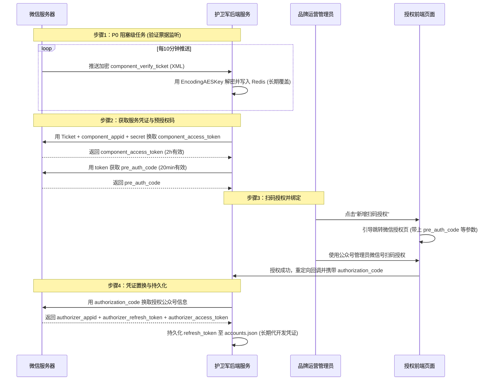
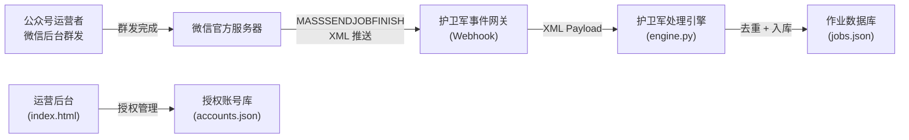
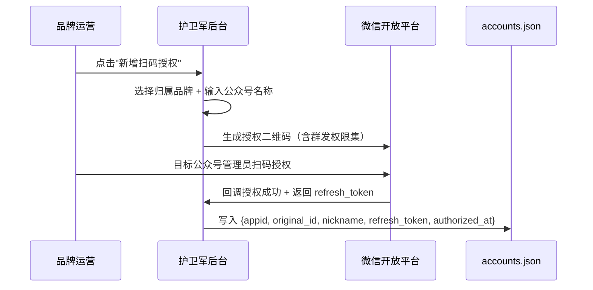
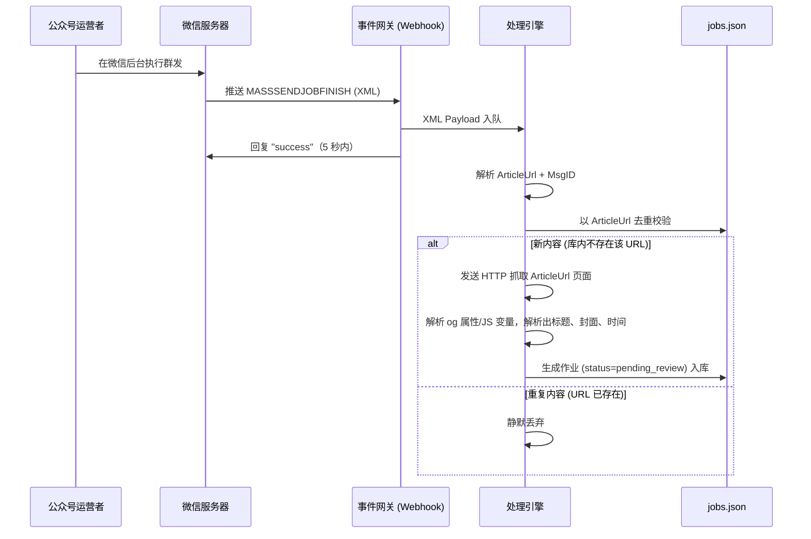
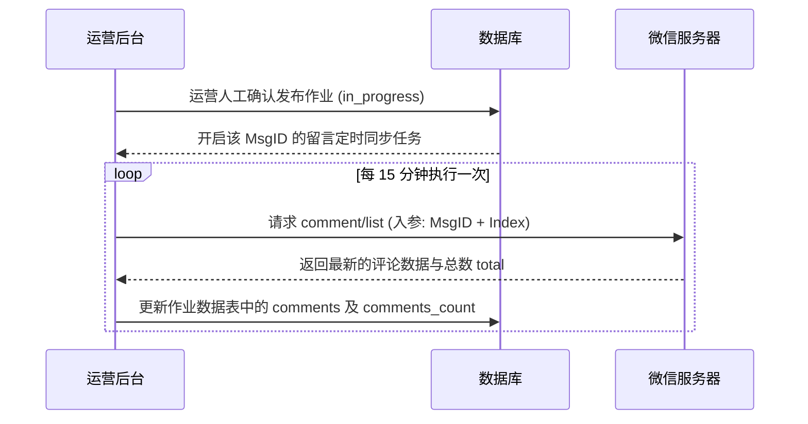

# 护卫军 · 公众号推送监控系统 — 技术实现路径 PRD (V1.0 本期规范)

> **仓库路径**：`/Users/RondoT/Documents/护卫军相关/公众号授权/`  
> **本期目标**：实现微信代公众号扫码授权、凭证维护、群发事件实时捕获、文章网页公开元数据去重抓取并入库。

---

## 1. 项目全景

### 1.1 业务目标 (V1.0 范围)

为东风汽车集团（含子品牌矩阵：东风日产、岚图汽车、东风本田等）搭建公众号群发实时感知骨架，本期实现：

| 目标 | 说明 | 对应版本 |
|------|------|---------|
| **授权关系绑定** | 引导子品牌运营扫码，将公众号授权给第三方平台，获取长期凭证。 | **V1.0 (本期)** |
| **群发内容毫秒感知** | 公众号运营后台执行群发，系统通过 Webhook 推送毫秒级感知。 | **V1.0 (本期)** |
| **文章详情抓取与去重** | 提取 ArticleUrl，去重校验后通过 HTTP 抓取解析文章标题、封面、发布时间并写入作业库。 | **V1.0 (本期)** |

### 1.2 系统角色 (V1.0 范围)

| 角色 | 典型用户 | 本期系统权限 |
|------|----------|----------|
| 超级管理员 | 护卫军项目组 | 管理品牌大盘，查看已授权账号及捕获到的待审核作业。 |
| 品牌运营 | 东风汽车各品牌市场部 | 新增扫码授权公众号、查看本品牌捕获的文章作业列表。 |

### 1.3 版本迭代规划

为降低交付风险，本期项目将采取**渐进式迭代**。技术团队在第一阶段（V1.0）应聚焦于完成公众号底层授权机制及群发内容的自动实时感知与抓取：

*   **V1.0（本期核心：授权接入与内容感知）**
    *   **代公众号授权绑定**：通过第三方开放平台代公众号发起扫码授权，换取并持久化 `refresh_token`。
    *   **授权凭证维护**：实现 `component_access_token` 和 `authorizer_access_token` 的自动刷新服务。
    *   **事件网关接收**：部署 Webhook 接口接收 `MASSSENDJOBFINISH`（群发结束）推送，5 秒内幂等响应。
    *   **URL 全局去重**：以 `ArticleUrl` 为排他性唯一约束进行全局去重。
    *   **图文信息抓取**：对公开 `ArticleUrl` 发送轻量请求，通过正则匹配兼容解析提取标题、封面、摘要与发布时间。
    *   **作业自动创建**：图文成功捕获后，在数据库自动生成 `status = pending_review` 的初始作业记录。

*   **V1.1（下期演进：留言抓取与作业下发）**
    *   **文章留言拉取**：依群发 `MsgID` 异步调用 `comment/list` 接口，拉取、精选并同步文章留言列表。
    *   **作业分发管理**：运营在后台将作业指派给指定网评员，网评员在移动端接收作业并上传提交截图与链接。

*   **V2.0（未来规划：积分激励与 AI 智能审核）**
    *   **积分激励体系**：网评员完成作业后获得积分，数据按 10:1 与友福利商城 API 对账并同步兑换。
    *   **AI 智能审核**：集成 HiAgent AI 模块，对网评员上传的截图与内容自动进行语义及合规审查。
    *   **自动催收通知**：对超时未完成的作业向网评员发送催收提醒。

---

## 2. 微信第三方平台前置开发准备 (V1.0 必需)

本系统需要实现对东风汽车集团旗下“多子品牌、多公众号的长期托管与代开发授权机制”，**绝对不能向各品牌公众号索要其本身的 AppID 与 AppSecret**（因这涉及极高安全合规风险且违反微信规范）。技术开发团队必须前置搭建并配置“微信第三方平台（开放平台服务商模式）”。

### 2.1 为什么必须搭建第三方平台？
* **合规与安全性**：子品牌公众号通过“扫码确认”将指定的接口权限集（如群发消息、留言管理）托管给本平台。平台通过微信下发的授权令牌进行代开发操作，无需知晓公众号本身的 Secret，符合安全审计要求。
* **多公众号统一感知**：微信第三方平台允许配置统一的“消息与事件接收URL”。当任何已授权的子品牌公众号群发文章时，微信均会推送 `MASSSENDJOBFINISH` 到该统一地址，从而实现一个后台对所有品牌的全局感知。

### 2.2 微信第三方平台搭建配置流程
开发团队在编写任何业务代码前，必须首先完成微信官方的第三方平台注册、资质审核与核心配置，详见[官方文档：如何成为第三方平台](https://developers.weixin.qq.com/doc/oplatform/Third-party_Platforms/2.0/getting_started/how_to_be.html)。具体前置准备分为两部分：

#### 2.2.1 账号与资质申请
1. **资质认证**：注册微信开放平台账号，并完成**企业级开发者资质认证**（需企业主体营业执照，微信收取认证费 300 元/年）。
2. **平台创建**：在开放平台管理中心创建**第三方平台**，选择**“平台型服务商”**类型（此类型才支持代公众号调用接口及批量化服务）。

#### 2.2.2 核心开发参数配置表
在第三方平台后台的“开发配置”中，技术团队必须前置配置以下关键参数：

| 参数名称 | 配置值/规则 | 必要性 | 技术作用与要求 |
| :--- | :--- | :--- | :--- |
| **授权发起页域名** | 如 `admin.huweijun.com` | ✅ 必需 | 展示扫码授权二维码页面的所在域名，微信会校验来源域名安全性。 |
| **授权事件接收URL** | 如 `https://api.huweijun.com/v1/wechat/component/events` | ✅ 必需 | 接收微信每 **10分钟** 推送一次的验证票据 `component_verify_ticket`，以及公众号授权成功/更新/取消的回调通知。 |
| **消息与事件接收URL** | 如 `https://api.huweijun.com/v1/wechat/events/$APPID$` | ✅ 必需 | 统一接收已授权公众号收到的事件推送（如群发结束事件 `MASSSENDJOBFINISH`）。其中 `$APPID$` 为占位符，微信推送时会自动替换为对应公众号的 AppID。 |
| **消息校验 Token** | 开发者自定义的字符串 | ✅ 必需 | 用于验证推送请求是否来自微信官方服务器，进行解密签名校验。 |
| **消息加解密 Key** | 开发者生成的 EncodingAESKey (43位) | ✅ 必需 | 微信推送的所有 XML 报文均为加密格式，技术团队必须使用此 Key 和微信官方加解密 SDK 进行报文解密。 |
| **授权测试公众号列表** | 被授权测试公众号的**原始 ID** (gh_xxx) | ✅ 必需 | **开发阶段核心防坑点**。在第三方平台未正式发布“全网发布”前，普通公众号扫码会报错。必须在此配置白名单，只有白名单内的测试公众号才能扫码测试。 |

---

### 2.3 微信代授权生命周期与核心阻塞任务 (P0 级别)
这是整个 V1.0 系统的运行骨架，开发团队**必须优先打通以下步骤，尤其是 P0 阻塞性任务**：



#### 2.3.1 核心阻塞点：验证票据 `component_verify_ticket` 监听
* **为什么是 P0 阻塞任务？**
  第三方开放平台没有可以直接调用获取 Token 的固定 API Secret。一切 API 访问的根源是 `component_access_token`，而换取它的前提是必须持有微信**每 10 分钟**向“授权事件接收URL”推送的最新 `component_verify_ticket`。
* **技术避坑要点**：
  1. **冷启动延迟**：首次在开放平台后台点击保存开发参数时，微信会在 10 分钟内发起第一次 Ticket 推送，此时网关必须已部署并正常工作，否则无法成功保存配置。
  2. **高可用持久化**：Ticket 必须妥善持久化存储（推荐 Redis 或数据库，不推荐本地内存）。每次微信推送时均需用最新的 Ticket 覆盖旧值。若系统因网络波动、宕机等原因导致连续 20 分钟以上未更新 Ticket，平台凭证置换链条将彻底断裂，所有代开发接口均会报错。
  3. **加解密算法**：收到的 Ticket 推送是密文 XML，必须使用对应语言的微信安全加解密库（`WXBizMsgCrypt`）进行解密并验签，签名不一致或解密失败的请求应直接拒绝。

#### 2.3.2 令牌置换置信链 (TOKEN CHAIN)
* **`component_verify_ticket`** (微信推送，每10分钟变化，必须保存)。
* **`component_access_token`** (用 Ticket 换取，2小时有效，推荐设置 1小时50分 定时任务刷新，写入共享缓存)。
* **`pre_auth_code`** (用组件 token 换取，20分钟有效，仅在引导扫码前临时生成)。
* **`authorizer_refresh_token`** (扫码成功后换取，**长期有效**。用于在其对应的 `authorizer_access_token` 过期时自动刷新。一旦丢失或失效，必须让客户管理员重新扫码授权)。
* **`authorizer_access_token`** (代表公众号调用 API 的直接令牌，2小时有效。系统必须后台自动轮询，使用对应的 `authorizer_refresh_token` 换取新令牌)。

---

---

## 3. 技术架构 (V1.0)

### 3.1 架构图



### 3.2 核心架构思路

系统采用**被动感知架构**：在微信第三方开放平台配置 Webhook 事件接收网关。微信服务器在群发完成后主动向我方推送 `MASSSENDJOBFINISH` 事件，处理引擎仅需轻量级 XML 解析即可完成新内容感知。

*   **监控 0 盲区**：100% 覆盖微信公众号最为核心的“群发（Mass Send）”场景。
*   **感知 0 延迟**：群发完成即时推送，毫秒级流转至监控引擎。
*   **API 0 损耗**：无需主动轮询，不消耗微信 API 每日调用限额。

---

## 4. 微信接口对照表 (V1.0 范围)

### 4.1 授权凭证管理 — 刷新 Access Token

| 字段 | 值 |
|------|-----|
| **接口 URL** | `https://api.weixin.qq.com/cgi-bin/component/api_authorizer_token?component_access_token={TOKEN}` |
| **方法** | POST |
| **用途** | 用 refresh_token 换取公众号的 authorizer_access_token（有效期 2 小时） |
| **代码位置** | [wechat_api.py L17-L41](file:///Users/RondoT/Documents/护卫军相关/公众号授权/wechat_api.py) — `_refresh_access_token()` |

**请求参数：**

| 字段 | 类型 | 必填 | 说明 |
|------|------|------|------|
| `component_appid` | string | ✅ | 第三方平台的 AppID |
| `authorizer_appid` | string | ✅ | 被授权公众号的 AppID |
| `authorizer_refresh_token` | string | ✅ | 授权时获得的 refresh_token，长期有效 |

**响应参数：**

| 字段 | 类型 | 说明 |
|------|------|------|
| `authorizer_access_token` | string | 授权方接口调用凭据，2 小时有效 |
| `expires_in` | int | 有效期（秒），通常为 7200 |
| `authorizer_refresh_token` | string | 新的 refresh_token（需更新存储） |

---

### 4.2 群发事件接收 — MASSSENDJOBFINISH

| 字段 | 值 |
|------|-----|
| **接收 URL** | `https://api.huweijun.com/v1/wechat/events/$APPID$`（在开放平台配置） |
| **方法** | POST（微信主动推送，被动接收） |
| **格式** | XML |
| **官方文档** | [微信官方文档 · 群发消息结果推送](https://developers.weixin.qq.com/doc/service/guide/product/message/Batch_Sends.html) |
| **方案设计** | [mass_send_monitoring_solution.md](file:///Users/RondoT/Documents/护卫军相关/公众号授权/mass_send_monitoring_solution.md) |

**XML 报文结构：**

```xml
<xml>
  <ToUserName><![CDATA[gh_dongfeng]]></ToUserName>
  <FromUserName><![CDATA[o_admin_id]]></FromUserName>
  <CreateTime>1778483734</CreateTime>
  <MsgType><![CDATA[event]]></MsgType>
  <Event><![CDATA[MASSSENDJOBFINISH]]></Event>
  <MsgID>1000001625</MsgID>
  <Status><![CDATA[sendsuccess]]></Status>
  <ArticleUrlResult>
    <Count>1</Count>
    <ResultList>
      <item>
        <ArticleIdx>1</ArticleIdx>
        <ArticleUrl><![CDATA[https://mp.weixin.qq.com/s/xxx]]></ArticleUrl>
      </item>
    </ResultList>
  </ArticleUrlResult>
</xml>
```

**关键字段提取：**

| 字段 | XPath | 用途 |
|------|-------|------|
| `MsgID` | `xml → MsgID` | 群发唯一标识，用于标识该次推送及后续关联 |
| `ArticleUrl` | `xml → ArticleUrlResult → ResultList → item → ArticleUrl` | 文章永久链接，用于**全局去重** + 元数据抓取入口 |
| `Status` | `xml → Status` | 群发状态：`sendsuccess` 为成功状态，非此状态不予处理 |
| `ArticleIdx` | `xml → ArticleUrlResult → ResultList → item → ArticleIdx` | 多图文中的位置索引（1-based） |

**网关响应要求：**
- 必须在 5 秒内返回字符串 `"success"`，否则微信将重试推送（最多重试 3 次）。
- 重试与去重设计：利用 `ArticleUrl` 或 `MsgID` 缓存锁 10s，防止并发处理重试报文；在作业表中对 `url`（`ArticleUrl`）建立唯一约束，冲突则静默丢弃。

**文章元数据获取机制 (ArticleUrl 抓取)：**
由于微信未提供根据 URL 查询文章详情的直接 API，系统接收到 `ArticleUrl` 后：
1. 发送 HTTP GET 请求抓取页面。
2. 解析 HTML 中的标准 Open Graph (OG) 属性及 JS 变量：
   - 标题：`og:title` 或 JS 变量 `msg_title` / H1 标签内容。
   - 封面：`og:image` 或 JS 变量 `msg_cdn_url`。
   - 摘要：`og:description` 或 JS 变量 `msg_desc`。
   - 发布时间：提取 HTML 中全局 JS 变量 `ct` 对应的秒级时间戳。

---

## 5. 数据模型 (V1.0 范围)

### 5.1 授权账号（accounts.json）

| 字段 | 类型 | 说明 | 示例 |
|------|------|------|------|
| `appid` | string | 公众号 AppID | `"wx4f2a3b4c5d6e7f89"` |
| `nickname` | string | 公众号昵称 | `"东风汽车"` |
| `original_id` | string | 公众号原始 ID | `"gh_dongfeng"` |
| `refresh_token` | string | 授权 Refresh Token（长期有效） | `"mock_refresh_token_xyz"` |
| `authorized_at` | int | 授权时间戳 | `1778483734` |

存储文件：[accounts.json](file:///Users/RondoT/Documents/护卫军相关/公众号授权/accounts.json)

### 5.2 监控作业（jobs.json — V1.0 精简版）

| 字段 | 类型 | 说明 | 数据来源 |
|------|------|------|----------|
| `article_id` | string | 作业唯一标识 | `MsgID_ArticleIdx` |
| `account_name` | string | 归属公众号名称 | accounts → nickname |
| `title` | string | 文章标题 | ArticleUrl 页面抓取解析 |
| `url` | string | 文章永久链接 (唯一索引) | ArticleUrl |
| `digest` | string | 文章摘要 | ArticleUrl 页面抓取解析 |
| `thumb` | string | 封面图链接 | ArticleUrl 页面抓取解析 |
| `publish_time` | int | 发布时间戳 | ArticleUrl 页面 JS 变量 `ct` |
| `status` | string | 作业状态 (固定为 `pending_review`) | 系统设定 |
| `fetched_at` | int | 数据抓取时间戳 | `time.time()` |

---

## 6. 代码文件职责映射 (V1.0 范围)

| 文件 | 定位 | V1.0 核心职责 |
|------|------|--------------|
| [wechat_api.py](file:///Users/RondoT/Documents/护卫军相关/公众号授权/wechat_api.py) | 微信 API 封装层 | Token 刷新 (`_refresh_access_token`)、群发 XML 事件解析 (`parse_mass_send_event`)、文章网页元数据免依赖正则抓取器 (`fetch_article_meta`)。 |
| [engine.py](file:///Users/RondoT/Documents/护卫军相关/公众号授权/engine.py) | 调度引擎 | 接收网关 XML 事件并流转，调用去重，创建 V1.0 作业入库；支持本地 run_once 模拟调试。 |
| [storage.py](file:///Users/RondoT/Documents/护卫军相关/公众号授权/storage.py) | 本地存储层 | 读写 `accounts.json` 和 `jobs.json`，执行基于 URL 的唯一去重判断。 |

---

## 7. 核心处理流程 (V1.0)

### 7.1 公众号授权流程



### 7.2 群发感知 → 作业生成流程



---

## 8. 开放平台权限集要求 (V1.0)

| 权限集 | 作用 | 必要性 |
|--------|------|--------|
| **群发权限集** | 接收 `MASSSENDJOBFINISH` 事件推送 | 🔴 必需 |

---

## 9. 接口调用链路速查 (V1.0)

```
授权绑定：
  开放平台扫码 → 获取 refresh_token → 存入 accounts.json
  ↓
凭证维护：
  api_authorizer_token (POST) → 用 refresh_token 换 access_token（2h 有效）
  ↓
事件捕获：
  Webhook 接收 MASSSENDJOBFINISH → 解析 ArticleUrl + MsgID + ArticleIdx
  ↓
去重校验：
  检查 jobs.json 中是否存在该 ArticleUrl
  ↓
详情抓取：
  HTTP GET ArticleUrl -> 正则提取 og 元数据及时间变量 ct -> 写入作业
```

---

## 10. 当前实现状态

### 已完成（Demo 级别）

- ✅ 微信 API 封装（Mock + 真实双模式）
- ✅ 调度引擎（可运行）
- ✅ 本地 JSON 存储
- ✅ 运营后台 UI 完整原型（5 模块）
- ✅ 授权管理 UI（扫码模拟 + 品牌归属）
- ✅ 作业管理 UI（四步向导 + 文章关联）
- ✅ 事件驱动方案演示沙盘
- ✅ 积分页移动端原型

### 待建设（生产化）

| 模块 | 优先级 | 说明 | 规划版本 |
|------|--------|------|---------|
| **Webhook 事件网关** | P0 | 部署并运行接收微信 `MASSSENDJOBFINISH` 推送的 HTTP 网关服务 | **V1.0 (本期)** |
| **XML 解析器** | P0 | 解析微信推送的 XML 报文，提取 `ArticleUrl` 和 `MsgID` | **V1.0 (本期)** |
| **持久化数据库** | P0 | 将 JSON 文件数据结构重构并替换为 MySQL / PostgreSQL，设置唯一索引 | **V1.0 (本期)** |
| **Token 管理服务** | P1 | `component_access_token` 定时刷新机制与多节点分布式缓存 | **V1.0 (本期)** |
| **授权回调处理** | P1 | 接收第三方平台授权事件回调，自动写入 `accounts` 数据表 | **V1.0 (本期)** |
| **评论数据抓取** | P1 | 基于群发 `MsgID` 异步调用 `comment/list` 接口并入库 | **V1.1** |
| **数据大屏与统计** | P1 | 展现文章发布量、评论量、作业覆盖率、积分兑换排名等可视化看板 | **V1.1** |
| **任务分发与审核模块** | P2 | 网评员接收任务、人工审核、作业状态流转状态机 | **V1.1** |
| **AI 智能审核集成** | P2 | 接入 HiAgent AI 模块对网评员上传的内容及截图进行自动语义分析 | **V2.0** |
| **积分商城系统对接** | P2 | 对接友福利商城 API，完成积分的核算、清算与 10:1 账户同步兑换 | **V2.0** |
| **用户权限系统 (RBAC)** | P2 | 管理员、品牌运营、网评员三级角色权限控制 | **V2.0** |
| **消息催收模块** | P3 | 对超时未完成或漏交的作业向网评员发送自动催告通知 | **V2.0** |

---
---

# 未来版本技术演进规划 (开发备查，非本期交付)

## 二、V1.1 阶段规划 (留言评论拉取与任务分发)

### 1. 新增接入接口 — comment/list

用于拉取已群发文章下的用户评论数据，作为 AI 质检和人工审核的输入。

| 字段 | 值 |
|------|-----|
| **接口 URL** | `https://api.weixin.qq.com/cgi-bin/comment/list?access_token={ACCESS_TOKEN}` |
| **方法** | POST |
| **用途** | 拉取指定文章下的用户评论列表（最大 50 条/次） |
| **官方文档** | [微信官方文档 · 图文消息留言管理](https://developers.weixin.qq.com/doc/offiaccount/Comments_management/Image_Comments_Management_Interface.html) |

**请求参数：**
*   `msg_data_id`：群发返回的 MsgID。
*   `index`：多图文中的位置索引（0-based）。
*   `begin` / `count` / `type`。

### 2. 数据模型扩展 (jobs.json)
一期生成的作业在 V1.1 将自动扩展以下字段，用以存放评论数据：
*   `comments_count`：int，评论总数。
*   `comments`：array，包含每一条评论的 `content`（留言内容）和 `create_time`（留言时间戳）。

### 3. V1.1 核心留言捕获流程时序



### 4. 权限集要求扩展
*   代公众号授权时，需要额外勾选：**留言与评论管理权限集**。

---

## 三、V2.0 阶段规划 (积分商城对接与 AI 智能审核)

### 1. 积分激励对账接口
*   **接口用途**：将网评员完成作业所获积分以 10:1 的比例同步至友福利商城后端账户中。
*   **交互逻辑**：网评员提交截图 -> 运营审核完成 -> 调用积分同步 API 修改网评员商城积分余值。

### 2. HiAgent AI 审核集成
*   **业务逻辑**：网评员提交截图后，系统异步调用 HiAgent 图像及文本审查 API，自动进行内容相似度及合规度判定，辅助人工审核或直接放行。

### 3. 自动消息催收
*   **业务逻辑**：对于任务开始后 2 小时仍未完成提交的网评员，系统自动通过模版消息/微信通知，进行自动消息催收。
