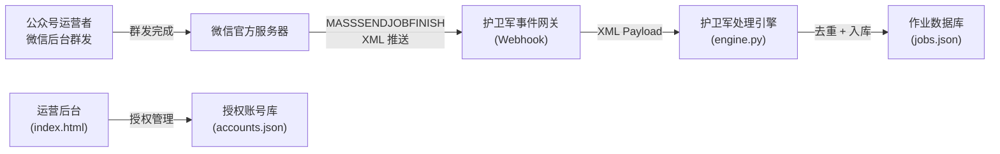
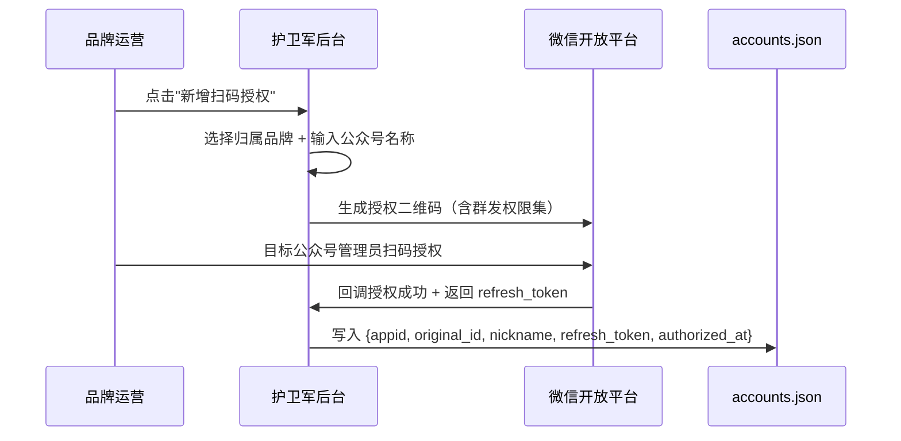
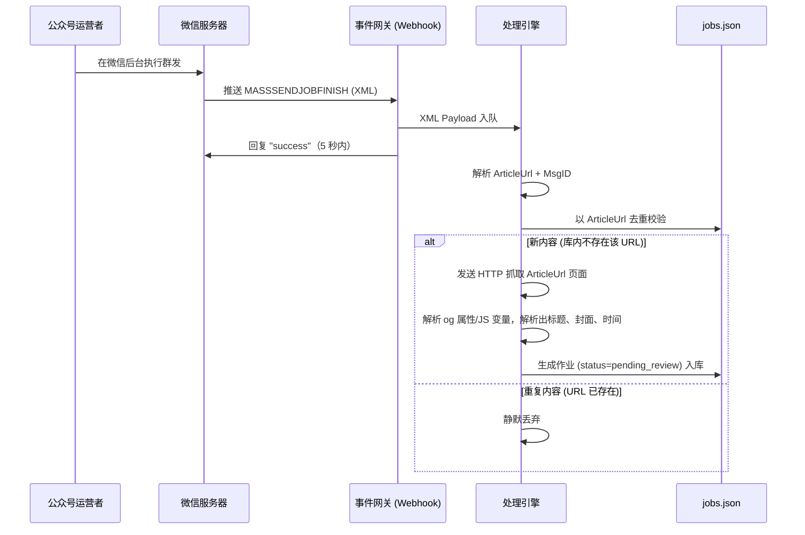
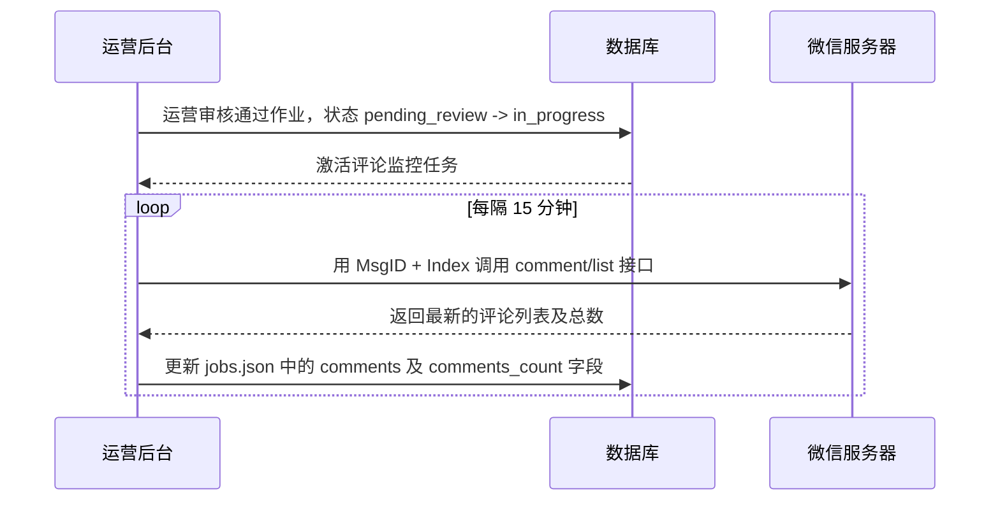

# 护卫军 · 公众号推送监控系统 — 技术实现路径 PRD (V1.0 本期规范)

> **仓库路径**：`/Users/RondoT/Documents/护卫军相关/公众号授权/`  
> **本期目标**：实现微信代公众号扫码授权、凭证维护、群发事件实时捕获、文章网页公开元数据去重抓取并入库。

---

## 1. 项目全景

### 1.1 业务目标 (V1.0 范围)

为东风汽车集团（含子品牌矩阵：东风日产、岚图汽车、东风本田等）搭建公众号群发实时感知骨架，本期实现：

| 目标 | 说明 | 对应版本 |
|------|------|---------|
| **授权关系绑定** | 引导子品牌运营扫码，将公众号授权给第三方平台，获取长期凭证。 | **V1.0 (本期)** |
| **群发内容毫秒感知** | 公众号运营后台执行群发，系统通过 Webhook 推送毫秒级感知。 | **V1.0 (本期)** |
| **文章详情抓取与去重** | 提取 ArticleUrl，去重校验后通过 HTTP 抓取解析文章标题、封面、发布时间并写入作业库。 | **V1.0 (本期)** |

### 1.2 系统角色 (V1.0 范围)

| 角色 | 典型用户 | 本期系统权限 |
|------|----------|----------|
| 超级管理员 | 护卫军项目组 | 管理品牌大盘，查看已授权账号及捕获到的待审核作业。 |
| 品牌运营 | 东风汽车各品牌市场部 | 新增扫码授权公众号、查看本品牌捕获的文章作业列表。 |

---

## 2. 技术架构 (V1.0)

### 2.1 架构图



### 2.2 核心架构思路

系统采用**被动感知架构**：在微信第三方开放平台配置 Webhook 事件接收网关。微信服务器在群发完成后主动向我方推送 `MASSSENDJOBFINISH` 事件，处理引擎仅需轻量级 XML 解析即可完成新内容感知。

*   **监控 0 盲区**：100% 覆盖微信公众号最为核心的“群发（Mass Send）”场景。
*   **感知 0 延迟**：群发完成即时推送，毫秒级流转至监控引擎。
*   **API 0 损耗**：无需主动轮询，不消耗微信 API 每日调用限额。

---

## 3. 微信接口对照表 (V1.0 范围)

### 3.1 授权凭证管理 — 刷新 Access Token

| 字段 | 值 |
|------|-----|
| **接口 URL** | `https://api.weixin.qq.com/cgi-bin/component/api_authorizer_token?component_access_token={TOKEN}` |
| **方法** | POST |
| **用途** | 用 refresh_token 换取公众号的 authorizer_access_token（有效期 2 小时） |
| **代码位置** | [wechat_api.py L17-L41](file:///Users/RondoT/Documents/护卫军相关/公众号授权/wechat_api.py) — `_refresh_access_token()` |

**请求参数：**

| 字段 | 类型 | 必填 | 说明 |
|------|------|------|------|
| `component_appid` | string | ✅ | 第三方平台的 AppID |
| `authorizer_appid` | string | ✅ | 被授权公众号的 AppID |
| `authorizer_refresh_token` | string | ✅ | 授权时获得的 refresh_token，长期有效 |

**响应参数：**

| 字段 | 类型 | 说明 |
|------|------|------|
| `authorizer_access_token` | string | 授权方接口调用凭据，2 小时有效 |
| `expires_in` | int | 有效期（秒），通常为 7200 |
| `authorizer_refresh_token` | string | 新的 refresh_token（需更新存储） |

---

### 3.2 群发事件接收 — MASSSENDJOBFINISH

| 字段 | 值 |
|------|-----|
| **接收 URL** | `https://api.huweijun.com/v1/wechat/events/$APPID$`（在开放平台配置） |
| **方法** | POST（微信主动推送，被动接收） |
| **格式** | XML |
| **官方文档** | [微信官方文档 · 群发消息结果推送](https://developers.weixin.qq.com/doc/service/guide/product/message/Batch_Sends.html) |
| **方案设计** | [mass_send_monitoring_solution.md](file:///Users/RondoT/Documents/护卫军相关/公众号授权/mass_send_monitoring_solution.md) |

**XML 报文结构：**

```xml
<xml>
  <ToUserName><![CDATA[gh_dongfeng]]></ToUserName>
  <FromUserName><![CDATA[o_admin_id]]></FromUserName>
  <CreateTime>1778483734</CreateTime>
  <MsgType><![CDATA[event]]></MsgType>
  <Event><![CDATA[MASSSENDJOBFINISH]]></Event>
  <MsgID>1000001625</MsgID>
  <Status><![CDATA[sendsuccess]]></Status>
  <ArticleUrlResult>
    <Count>1</Count>
    <ResultList>
      <item>
        <ArticleIdx>1</ArticleIdx>
        <ArticleUrl><![CDATA[https://mp.weixin.qq.com/s/xxx]]></ArticleUrl>
      </item>
    </ResultList>
  </ArticleUrlResult>
</xml>
```

**关键字段提取：**

| 字段 | XPath | 用途 |
|------|-------|------|
| `MsgID` | `xml → MsgID` | 群发唯一标识，用于标识该次推送及后续关联 |
| `ArticleUrl` | `xml → ArticleUrlResult → ResultList → item → ArticleUrl` | 文章永久链接，用于**全局去重** + 元数据抓取入口 |
| `Status` | `xml → Status` | 群发状态：`sendsuccess` 为成功状态，非此状态不予处理 |
| `ArticleIdx` | `xml → ArticleUrlResult → ResultList → item → ArticleIdx` | 多图文中的位置索引（1-based） |

**网关响应要求：**
- 必须在 5 秒内返回字符串 `"success"`，否则微信将重试推送（最多重试 3 次）。
- 重试与去重设计：利用 `ArticleUrl` 或 `MsgID` 缓存锁 10s，防止并发处理重试报文；在作业表中对 `url`（`ArticleUrl`）建立唯一约束，冲突则静默丢弃。

**文章元数据获取机制 (ArticleUrl 抓取)：**
由于微信未提供根据 URL 查询文章详情的直接 API，系统接收到 `ArticleUrl` 后：
1. 发送 HTTP GET 请求抓取页面。
2. 解析 HTML 中的标准 Open Graph (OG) 属性及 JS 变量：
   - 标题：`og:title` 或 JS 变量 `msg_title` / H1 标签内容。
   - 封面：`og:image` 或 JS 变量 `msg_cdn_url`。
   - 摘要：`og:description` 或 JS 变量 `msg_desc`。
   - 发布时间：提取 HTML 中全局 JS 变量 `ct` 对应的秒级时间戳。

---

## 4. 数据模型 (V1.0 范围)

### 4.1 授权账号（accounts.json）

| 字段 | 类型 | 说明 | 示例 |
|------|------|------|------|
| `appid` | string | 公众号 AppID | `"wx4f2a3b4c5d6e7f89"` |
| `nickname` | string | 公众号昵称 | `"东风汽车"` |
| `original_id` | string | 公众号原始 ID | `"gh_dongfeng"` |
| `refresh_token` | string | 授权 Refresh Token（长期有效） | `"mock_refresh_token_xyz"` |
| `authorized_at` | int | 授权时间戳 | `1778483734` |

存储文件：[accounts.json](file:///Users/RondoT/Documents/护卫军相关/公众号授权/accounts.json)

### 4.2 监控作业（jobs.json — V1.0 精简版）

| 字段 | 类型 | 说明 | 数据来源 |
|------|------|------|----------|
| `article_id` | string | 作业唯一标识 | `MsgID_ArticleIdx` |
| `account_name` | string | 归属公众号名称 | accounts → nickname |
| `title` | string | 文章标题 | ArticleUrl 页面抓取解析 |
| `url` | string | 文章永久链接 (唯一索引) | ArticleUrl |
| `digest` | string | 文章摘要 | ArticleUrl 页面抓取解析 |
| `thumb` | string | 封面图链接 | ArticleUrl 页面抓取解析 |
| `publish_time` | int | 发布时间戳 | ArticleUrl 页面 JS 变量 `ct` |
| `status` | string | 作业状态 (固定为 `pending_review`) | 系统设定 |
| `fetched_at` | int | 数据抓取时间戳 | `time.time()` |

---

## 5. 代码文件职责映射 (V1.0 范围)

| 文件 | 定位 | V1.0 核心职责 |
|------|------|--------------|
| [wechat_api.py](file:///Users/RondoT/Documents/护卫军相关/公众号授权/wechat_api.py) | 微信 API 封装层 | Token 刷新 (`_refresh_access_token`)、群发 XML 事件解析 (`parse_mass_send_event`)、文章网页元数据免依赖正则抓取器 (`fetch_article_meta`)。 |
| [engine.py](file:///Users/RondoT/Documents/护卫军相关/公众号授权/engine.py) | 调度引擎 | 接收网关 XML 事件并流转，调用去重，创建 V1.0 作业入库；支持本地 run_once 模拟调试。 |
| [storage.py](file:///Users/RondoT/Documents/护卫军相关/公众号授权/storage.py) | 本地存储层 | 读写 `accounts.json` 和 `jobs.json`，执行基于 URL 的唯一去重判断。 |

---

## 6. 核心处理流程 (V1.0)

### 6.1 公众号授权流程



### 6.2 群发感知 → 作业生成流程



---

## 7. 开放平台权限集要求 (V1.0)

| 权限集 | 作用 | 必要性 |
|--------|------|--------|
| **群发权限集** | 接收 `MASSSENDJOBFINISH` 事件推送 | 🔴 必需 |

---

## 8. 接口调用链路速查 (V1.0)

```
授权绑定：
  开放平台扫码 → 获取 refresh_token → 存入 accounts.json
  ↓
凭证维护：
  api_authorizer_token (POST) → 用 refresh_token 换 access_token（2h 有效）
  ↓
事件捕获：
  Webhook 接收 MASSSENDJOBFINISH → 解析 ArticleUrl + MsgID + ArticleIdx
  ↓
去重校验：
  检查 jobs.json 中是否存在该 ArticleUrl
  ↓
详情抓取：
  HTTP GET ArticleUrl -> 正则提取 og 元数据及时间变量 ct -> 写入作业
```

---
---

# 未来版本技术演进规划 (开发备查，非本期交付)

## 二、V1.1 阶段规划 (留言评论拉取与任务分发)

### 1. 新增接入接口 — comment/list

用于拉取已群发文章下的用户评论数据，作为 AI 质检和人工审核的输入。

| 字段 | 值 |
|------|-----|
| **接口 URL** | `https://api.weixin.qq.com/cgi-bin/comment/list?access_token={ACCESS_TOKEN}` |
| **方法** | POST |
| **用途** | 拉取指定文章下的用户评论列表（最大 50 条/次） |
| **官方文档** | [微信官方文档 · 图文消息留言管理](https://developers.weixin.qq.com/doc/offiaccount/Comments_management/Image_Comments_Management_Interface.html) |

**请求参数：**
*   `msg_data_id`：群发返回的 MsgID。
*   `index`：多图文中的位置索引（0-based）。
*   `begin` / `count` / `type`。

### 2. 数据模型扩展 (jobs.json)
一期生成的作业在 V1.1 将自动扩展以下字段，用以存放评论数据：
*   `comments_count`：int，评论总数。
*   `comments`：array，包含每一条评论的 `content`（留言内容）和 `create_time`（留言时间戳）。

### 3. V1.1 核心业务时序变更



### 4. 权限集要求扩展
*   代公众号授权时，需要额外勾选：**留言与评论管理权限集**。

---

## 三、V2.0 阶段规划 (积分商城对接与 AI 智能审核)

### 1. 积分激励对账接口
*   **接口用途**：将网评员完成作业所获积分以 10:1 的比例同步至友福利商城后端账户中。
*   **交互逻辑**：网评员提交截图 -> 运营审核完成 -> 调用积分同步 API 修改网评员商城积分余值。

### 2. HiAgent AI 审核集成
*   **业务逻辑**：网评员提交截图后，系统异步调用 HiAgent 图像及文本审查 API，自动进行内容相似度及合规度判定，辅助人工审核或直接放行。

### 3. 自动消息催收
*   **业务逻辑**：对于任务开始后 2 小时仍未完成提交的网评员，系统自动通过模版消息/微信通知，进行自动消息催收。
